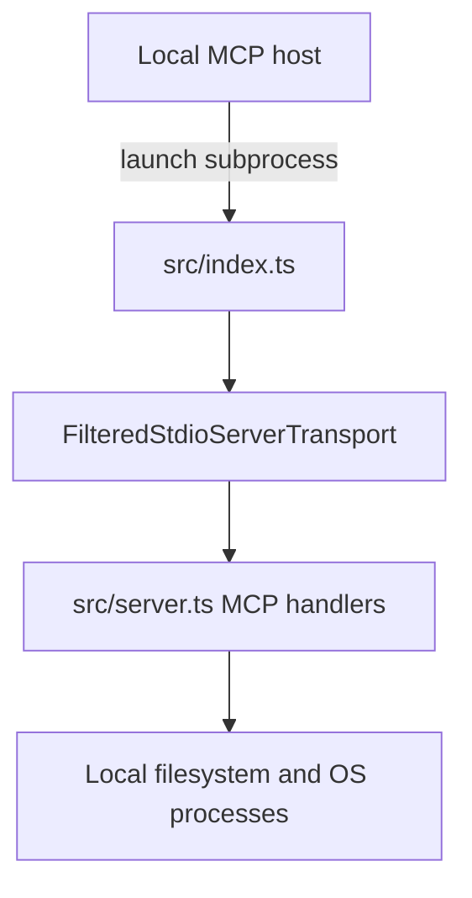
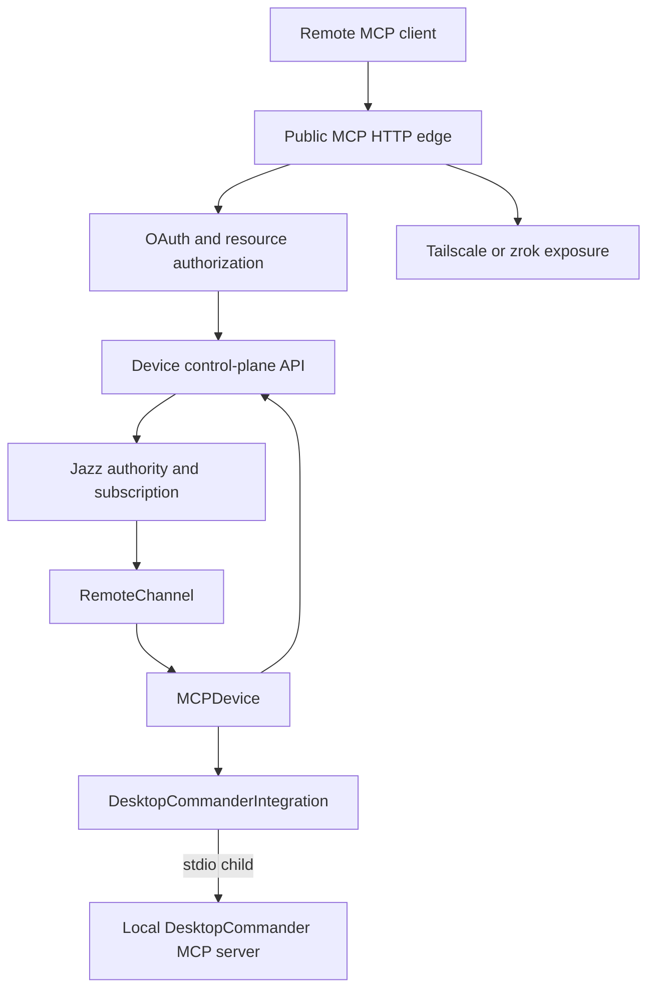
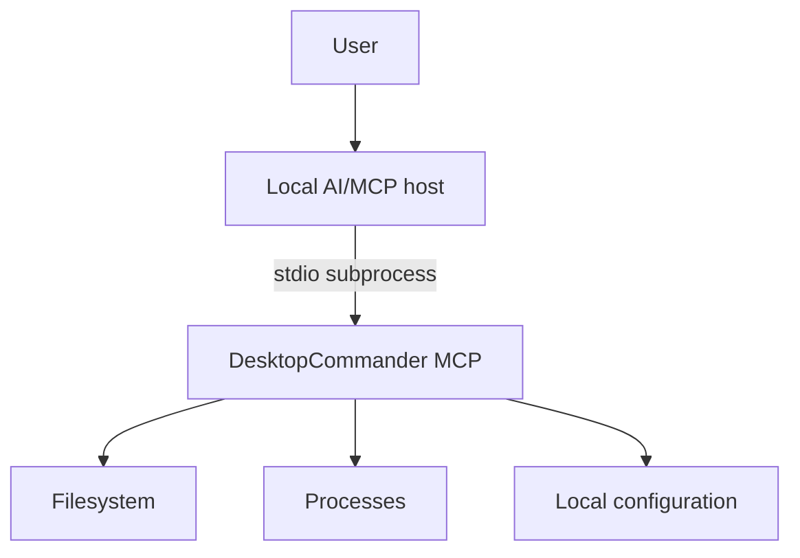
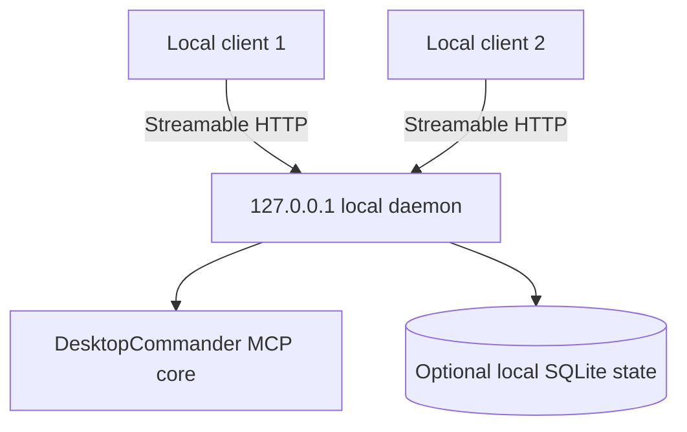
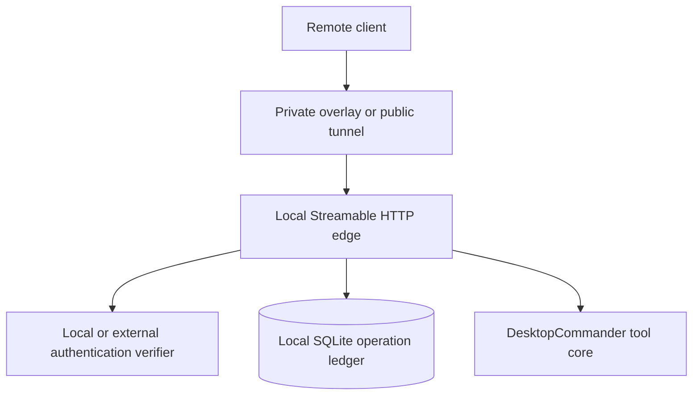
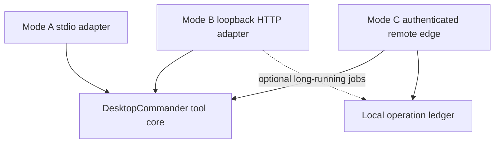

# Local-only, no-central-server architecture research

Status: research only — no implementation contract

Date: 2026-09-08

Scope: adapt DesktopCommander so its primary experience can run on the user's machine without a vendor-operated control plane. This document does not modify or supersede the passkey-only remote architecture plans.

## Executive summary

DesktopCommander already contains the core of a genuinely local product: `src/index.ts` starts the MCP server over stdio, and the MCP client launches that process directly. That path does not require a hosted account service, OAuth, passkeys, Jazz, a tunnel, device registration, heartbeats, or a public URL.

The term “without a server” needs three separate product modes:

1. **Mode A — local stdio:** the AI client and DesktopCommander run under the same OS user on the same machine. This is the only literal no-listener, no-central-server mode and should be the MVP/default.
2. **Mode B — local loopback daemon:** one long-lived DesktopCommander process serves multiple local clients over loopback Streamable HTTP. There is no hosted service, but there is still a local server process and a local authentication boundary.
3. **Mode C — user-owned remote edge:** the local daemon is reachable through a user-controlled private network or tunnel, such as Tailscale. The product may operate no central application server, but the system is not infrastructure-free: it still depends on a reachable local HTTP service and usually third-party coordination or relay infrastructure.

The recommended architecture is tiered rather than a single replacement for the hosted design:

```text
Mode A: local stdio             default and first MVP
Mode B: local loopback daemon   optional multi-client/local automation tier
Mode C: user-owned remote edge  optional remote tier with explicit limitations
Hosted remote architecture      retained for cloud clients, cross-device authority,
                                centralized revocation, and offline durable delivery
```

The most important limitation is client reachability. Local Claude/Codex/IDE clients can launch a stdio server. ChatGPT web and cloud-side OpenAI MCP calls cannot directly launch a process on the user's computer or reach `localhost`; they need a remotely reachable Streamable HTTP endpoint or a supported bridge such as Secure MCP Tunnel. A tunnel is a bridge, not elimination of the server boundary.

## Decision summary

### Recommended MVP

Ship and harden **Mode A — local stdio** first.

For this MVP:

- use the existing `src/index.ts` → `FilteredStdioServerTransport` → `server.connect()` path;
- let the MCP host launch and own the DesktopCommander process;
- rely on the OS account, process ancestry, MCP host configuration, sandbox/approval policy, and filesystem permissions as the local trust boundary;
- do not start `MCPDevice`, `RemoteChannel`, OAuth, Jazz, the control-plane client, or a tunnel;
- do not add a local operation ledger merely to imitate the remote architecture;
- retain user confirmation and least-privilege controls for consequential tools.

This is functional for local MCP hosts and avoids rebuilding a hosted identity system inside a desktop process.

### Recommended follow-on

Add Mode B only if multiple local clients, a persistent background process, or local HTTP integrations are a demonstrated requirement. Add Mode C only after defining the remote caller, authentication model, stable network identity, and acceptable loss of centralized revocation and offline delivery.

### Not recommended

Do not market a local daemon plus public tunnel as “serverless” or “no server.” It removes a vendor-operated application server, but it still contains:

- a local HTTP resource server;
- a public or private network edge;
- authentication and authorization state;
- lifecycle supervision;
- third-party network coordination in common deployments.

## Terminology and requirements

| Term | Meaning in this research |
| --- | --- |
| Local-only | Tool execution, state, and authority remain on one machine under one OS account. |
| No central server | DesktopCommander operates no shared vendor control plane for identity, delivery, or state. |
| No server process | No independently listening daemon. A stdio subprocess still executes code, but it is not a network server. |
| Local daemon | A long-lived process listening only on loopback or an authenticated local IPC endpoint. |
| User-owned remote edge | A local daemon exposed through infrastructure selected and administered by the user. |
| Cloud client | A client whose MCP connection originates from provider infrastructure rather than from the user's machine. |
| Durable delivery | A request can survive disconnects/restarts and later be delivered or reconciled without unsafe replay. |

The architecture must not conflate these goals. “No central server” is achievable for all three modes. “No server process” is achievable only for Mode A. Direct access from a cloud client is incompatible with a strict local-only/no-bridge design.

## Current architecture

### Existing local stdio path

The local path is already direct:



Repository evidence:

- `src/index.ts` selects local mode when the `remote` subcommand is absent.
- It creates `FilteredStdioServerTransport`, stores it as the active MCP transport, loads local configuration, and calls `server.connect(transport)`.
- `src/server.ts` owns the MCP server and registers the tool/resource/prompt handlers.
- The MCP stdio specification defines this lifecycle: the client launches the server subprocess, exchanges newline-delimited JSON-RPC on stdin/stdout, and terminates it when the connection closes.

There is no remote device identity or control-plane dependency in this path.

### Existing remote path

Remote mode adds a second process layer and several network authorities:



The current call path is:

1. `runRemote()` in `src/npm-scripts/remote.ts` optionally starts or verifies Tailscale/zrok transport.
2. `MCPDevice.start()` initializes the local stdio child through `DesktopCommanderIntegration`.
3. `DeviceTokenManager` loads or obtains an issuer/resource-bound OAuth session.
4. `RemoteChannel.registerDevice()` calls `DeviceControlPlaneClient.register()` and opens a short-lived Jazz subscription.
5. The device sends `heartbeat()` to represent availability.
6. A pending remote call is delivered through Jazz.
7. `MCPDevice.handleNewToolCall()` calls `claim()` before any local side effect.
8. The device invokes the tool through the nested local stdio client.
9. It calls `complete()` before teardown or other post-completion behavior.

`DeviceControlPlaneClient` currently contains five control-plane operations:

- `register`;
- `getJazzToken`;
- `heartbeat`;
- `claim`;
- `complete`.

These operations exist because the caller, execution process, authorization authority, and durable call record are separated by a network. They should not be copied into strict same-process stdio mode without a concrete failure or concurrency requirement.

### What the hosted architecture currently provides

The hosted/remote design provides properties that local stdio does not need and a user-owned remote edge does not automatically preserve:

- account identity spanning machines;
- passkey sign-in on a stable RP origin;
- OAuth client and grant lifecycle;
- exact issuer/resource/audience/scope enforcement;
- centralized device registration and revocation;
- durable online/offline status;
- call routing to one approved device;
- atomic claim-before-side-effect authority;
- durable completion and duplicate-delivery handling;
- short-lived Jazz subscription capability;
- a stable public MCP URL and metadata surface;
- recovery obligations for rotated/revoked credentials and bootstrap artifacts.

Removing the control plane is therefore trivial for Mode A but is an architectural relocation of responsibility for Mode C.

## Client feasibility matrix

| Client experience | Mode A: local stdio | Mode B: loopback HTTP | Mode C: user-owned edge | Hosted/public edge |
| --- | --- | --- | --- | --- |
| Claude Desktop or another local MCP host | Best fit | Possible if the host supports Streamable HTTP | Unnecessary for same-machine use | Possible but adds latency and exposure |
| Codex CLI / IDE / supported desktop host | Supported; official OpenAI docs list local stdio servers | Supported; official docs also list Streamable HTTP | Supported when the client can reach the edge | Supported |
| Local automation on the same OS account | Supported through an MCP client subprocess | Best fit for several independent clients | Unnecessary | Unnecessary |
| Another computer on the same LAN | No | Only if the listener is deliberately changed from loopback and separately secured; not recommended as the first design | Better through a private authenticated overlay | Possible |
| Another device in the same Tailscale tailnet | No | No, unless Tailscale/Serve fronts it | Feasible | Possible |
| ChatGPT desktop using local MCP configuration | Feasible where the current desktop client supports local stdio | Feasible where supported | Feasible | Feasible |
| ChatGPT web plugin/tool | No direct access to local stdio | No direct access to `localhost` | Only through a supported reachable bridge/edge | Required normal shape |
| OpenAI Responses API remote MCP tool | No | No direct access to `localhost` | Requires a reachable `server_url` or Secure MCP Tunnel | Supported with Streamable HTTP or HTTP/SSE |
| Offline use after initial installation | Yes, except tools that themselves need network access | Yes | Local use remains possible; remote access is unavailable | Usually not end-to-end offline |

OpenAI's current Codex documentation explicitly separates the cases: local Codex clients can connect directly to stdio servers, while ChatGPT web uses remote MCP-backed tools supplied by plugins and does not read local Codex configuration. OpenAI's remote MCP API requires a `server_url`; a private/on-premises server needs a supported tunnel or other reachable bridge.

## Architecture options

## Option A — local stdio

### Topology



### Properties

- No listening port.
- No public or loopback HTTP endpoint.
- One MCP host owns one process connection.
- Process lifetime naturally follows the MCP host.
- No remote account or device registration.
- No network bearer credential for DesktopCommander itself.
- Local tools continue to use their own upstream credentials when required.

### Authentication and authorization

Passkey/OAuth authentication is not meaningful for the normal same-user stdio boundary. The MCP authorization specification says the HTTP authorization flow is optional and that stdio implementations should retrieve credentials from the environment rather than follow that OAuth flow.

The relevant local controls are:

- the user deliberately configures the MCP host to launch DesktopCommander;
- the process runs under the user's OS identity;
- filesystem and keychain permissions isolate other OS users;
- the host's tool approval policy mediates consequential calls;
- DesktopCommander validates every tool input and enforces its own allow/deny settings;
- the process does not acquire elevated privileges implicitly.

OS identity is not proof that every prompt or model-generated action is safe. Prompt injection, confused intent, and destructive tools still require least privilege, clear tool annotations, and user approval.

### Delivery semantics

No `register`, `heartbeat`, `claim`, or `complete` protocol is required. A live JSON-RPC request arrives on the process-owned pipe and receives a response on the same connection.

For a process crash:

- the in-flight request fails;
- the MCP host may restart the subprocess;
- non-idempotent calls must not be silently retried unless the host and tool contract explicitly allow it;
- durable local application state must still use atomic writes or transactions where the tool itself requires them.

### Advantages

- smallest attack surface;
- lowest latency;
- works offline;
- no account onboarding;
- no token lifecycle;
- no stable network identity;
- reuses the proven existing execution path;
- minimal migration risk.

### Limitations

- one local host/process connection at a time unless the host starts independent instances;
- no cloud ChatGPT access;
- no cross-device routing;
- no offline remote queue;
- no centralized revocation or device directory;
- the local machine must be awake for use.

### Recommendation

This is the functional MVP and should remain the default even if later modes are added.

## Option B — local loopback daemon

### Topology



### When it is justified

Use a daemon only when at least one of these is required:

- several local clients share one DesktopCommander runtime;
- long-running local jobs must outlive a client connection;
- a GUI/tray application owns lifecycle and policy;
- a local browser or application must connect over HTTP;
- local call history or resumability is a product requirement.

### Required transport controls

The MCP transport specification requires or recommends the following for local Streamable HTTP:

- bind only to loopback rather than `0.0.0.0`;
- validate `Origin` on incoming connections to prevent DNS rebinding;
- authenticate connections;
- expose one MCP endpoint supporting the required POST/GET behavior;
- validate MCP protocol versions and session IDs;
- treat disconnect as distinct from explicit cancellation.

Additional local controls should include:

- strict `Host` allowlisting;
- no wildcard CORS;
- request/body limits and deadlines;
- startup-generated high-entropy bearer credential stored in the OS vault or an owner-only file;
- rotation on explicit reset and a safe handoff when the daemon restarts;
- no cookie authentication unless CSRF protections are designed and tested;
- owner-only state directory and database permissions;
- one per-user daemon, not a privileged system-wide daemon, for the first release.

A Unix domain socket or Windows named pipe can provide stronger local peer identity, but it is a custom transport unless wrapped by a compatible local adapter. Loopback Streamable HTTP is more interoperable; local IPC is a later hardening choice.

### Passkeys in loopback mode

A passkey can be useful only if the product needs an explicit human unlock or local administrative ceremony. It should not be added merely to replace process ownership with a web login.

If WebAuthn is retained:

- a browser-facing relying-party component still has to generate challenges, store credential records, and verify assertions;
- WebAuthn Level 3 permits the browser development exception for an `http://localhost` origin, with RP ID `localhost` and unrestricted port;
- this browser-only rule is different from OAuth loopback callback policy and from the current branch's stricter literal-IP rules for non-WebAuthn HTTP endpoints;
- exact expected origins and RP ID must be validated;
- browser compatibility, OS-user isolation, recovery, credential loss, and multiple OS accounts still need real tests.

For the MVP, prefer an OS-native confirmation mechanism or the MCP host's approval UI over implementing a local WebAuthn relying party.

### Recommendation

Do not put Mode B on the critical path for Mode A. Build it as a separate transport/lifecycle adapter around a shared tool core.

## Option C — user-owned remote edge

### Topology



### Two materially different variants

#### C1 — private tailnet edge

A user-controlled private overlay can expose the local daemon only to authenticated tailnet members. This avoids a public Internet listener but still depends on Tailscale coordination, device keys, ACLs/grants, and possibly relay infrastructure.

Recommended properties:

- keep the application listener on loopback and let the authenticated edge proxy it where possible;
- restrict reachability with tailnet policy;
- add application-level authorization for consequential tools;
- do not trust forwarded identity headers unless direct access to the backend is impossible and the proxy/header contract is verified;
- keep per-call approval available for sensitive actions.

This supports the user's other machines or selected tailnet principals. It does not make a cloud client part of the tailnet automatically.

#### C2 — public or cloud-bridged edge

A public Funnel, zrok share, reverse proxy, or Secure MCP Tunnel can make the local resource reachable to a cloud client. This restores the remote resource-server threat model:

- stable endpoint identity;
- TLS and proxy trust;
- OAuth or another interoperable client authentication mechanism;
- token audience and scope enforcement;
- rate limiting and abuse controls;
- protected-resource metadata where MCP OAuth is used;
- durable idempotency and uncertain-outcome handling;
- logs that never expose credentials or sensitive tool data;
- lifecycle behavior when the machine sleeps or changes networks.

A public tunnel does not remove the need for an authorization server. If the authorization service is also hosted on the local machine, its stable origin, WebAuthn RP ID, credential database, recovery, and availability become local operational responsibilities. If an external identity provider or managed tunnel is used, the product is no longer independent of external infrastructure even though it has no vendor-operated control plane.

### What is lost without a central authority

- one account revocation that immediately applies across every device;
- a globally authoritative device directory;
- server-observed abuse/rate limits across installations;
- reliable remote status while the machine is offline;
- durable call delivery while the edge is unreachable;
- centrally recoverable account/passkey state;
- cross-device audit records independent of the endpoint being investigated;
- atomic coordination when the same operation can target more than one machine.

A one-machine local authority can revoke its own credentials immediately. It cannot prove or enforce global revocation on other offline machines without a shared authority.

### Recommendation

Treat Mode C as a separate remote product, not as an extension flag on local stdio. Prefer C1 for user-to-own-device access. Use C2 only when a cloud client is required and retain the full remote security review.

## Recommended target architecture

### Shared tool core, separate adapters

The main design change should be separation of tool implementation from process/transport/remote-delivery concerns:



The tool core owns:

- tool schemas and validation;
- filesystem/process operations;
- local configuration and policy;
- safe error serialization;
- cancellation propagation;
- tool-specific idempotency or recovery behavior.

Transport adapters own:

- connection/session lifecycle;
- client identity and authentication appropriate to that transport;
- request deadlines/body limits;
- transport-specific cancellation and reconnection;
- translation to the common tool invocation interface.

The remote edge additionally owns:

- remote principal authorization;
- replay/idempotency handling;
- durable operation state where required;
- stable resource identity and network health.

### Avoid a nested stdio proxy in the new daemon

The current remote device deliberately spawns DesktopCommander as a child and proxies calls through `DesktopCommanderIntegration`. That isolation is useful while the remote layer is separate from the established server.

A purpose-built local daemon should instead instantiate the same tool core directly. Keeping a daemon → stdio MCP client → child MCP server chain would add:

- duplicate MCP lifecycle state;
- a second crash/restart boundary;
- unnecessary serialization;
- ambiguous ownership of cancellation and operation IDs;
- more difficult transaction boundaries around side effects.

Process isolation may still be chosen as a security boundary, but it must be an explicit sandbox design rather than an accidental consequence of reusing `MCPDevice`.

## Component-by-component disposition

| Current component/responsibility | Mode A | Mode B | Mode C |
| --- | --- | --- | --- |
| `src/server.ts` tool handlers | Retain | Retain behind HTTP adapter/shared core | Retain behind authenticated edge/shared core |
| `src/index.ts` stdio startup | Default entry point | Separate daemon entry point | Separate remote-edge entry point |
| `FilteredStdioServerTransport` | Retain | Not used by direct daemon | Not used unless process sandboxing is deliberate |
| `DesktopCommanderIntegration` nested stdio client | Remove from path | Avoid; invoke shared core directly | Avoid unless explicit process isolation is selected |
| `MCPDevice` | Not started | Not needed | Replace/refactor into remote-edge lifecycle owner |
| `RemoteChannel` | Remove | Remove | Replace Jazz subscription with direct HTTP dispatch and/or local ledger |
| `DeviceControlPlaneClient.register` | Remove | Remove | Replace with local installation identity/configuration; no global device row |
| `getJazzToken` | Remove | Remove | Remove with Jazz |
| `heartbeat` | Remove | Local daemon health only | Local edge health; no authoritative global presence while offline |
| `claim` | Remove | Usually unnecessary | Replace with atomic local operation claim before side effects |
| `complete` | Remove | Usually direct HTTP response | Persist terminal local result before returning/acknowledging when resumability is promised |
| Jazz database/subscription | Remove | Remove | Replace with direct request delivery; SQLite ledger only where durability is required |
| OAuth device flow and token manager | Remove | Replace with local bearer/IPC identity if needed | Keep or replace with an explicit remote principal auth design |
| Passkey account UI | Remove | Optional local unlock only | Needed only if the local/external authorization design uses browser identity |
| OS-vault OAuth session | Remove | Store only local daemon secret if selected | Store remote-edge credentials/keys under exact identity binding |
| Stable `deviceId`/`stableId` | Not needed for authorization | Optional installation ID for diagnostics | Retain a local installation ID; do not imply global registration |
| Tailscale/zrok tunnel supervisor | Remove | Remove | Retain only for the selected edge provider |
| RFC 9728 metadata and bearer challenge | Remove | Remove for unauthenticated local-only use | Required when using MCP HTTP OAuth |
| Central bootstrap/provisioning receipts | Remove | Remove | Replace with explicit user-owned edge setup; public cloud use may still need provisioning |
| Central revocation/cleanup obligations | Remove | Local secret deletion/rotation | Local durable cleanup plus external-provider revocation where applicable |
| Central telemetry/audit | Optional local diagnostics | Optional local diagnostics | Local audit; no independent central evidence unless user opts into export |

## Can Jazz be replaced by SQLite?

Yes for a **single-machine authority**, but not as a drop-in equivalent for globally available coordination.

### When SQLite is unnecessary

Mode A should dispatch the live stdio request directly. Adding an operations database would create complexity without improving the normal request/response contract.

Mode B can also dispatch ordinary short requests directly. SQLite is justified only for long-running jobs, resumable local workflows, or audit/idempotency requirements.

### When SQLite is appropriate

Mode C can use SQLite as the authoritative local operation ledger because execution and durable authority are on the same host. The remote HTTP handler can transact against the same database before invoking the tool.

Research-level schema sketch:

```sql
CREATE TABLE operations (
  operation_id TEXT PRIMARY KEY,
  principal_id TEXT NOT NULL,
  idempotency_key TEXT NOT NULL,
  request_hash BLOB NOT NULL,
  tool_name TEXT NOT NULL,
  status TEXT NOT NULL,
  claim_owner TEXT,
  claim_generation INTEGER NOT NULL DEFAULT 0,
  claimed_at TEXT,
  result_json TEXT,
  safe_error_code TEXT,
  created_at TEXT NOT NULL,
  updated_at TEXT NOT NULL,
  UNIQUE (principal_id, idempotency_key)
);
```

This is not a frozen schema. In particular, storing raw arguments/results may be unacceptable for DesktopCommander because they can contain file contents, paths, commands, or secrets. The implementation decision should prefer hashes and minimal recovery data, with encryption and bounded retention only where replaying a completed result is required.

### Claim-before-side-effect protocol

```text
1. Authenticate the remote principal.
2. Validate and canonicalize the tool request.
3. Compute a request hash over the canonical security-relevant input.
4. Insert (principal, idempotency key, request hash) or load the existing row.
5. Reject reuse of an idempotency key with a different request hash.
6. In BEGIN IMMEDIATE, transition pending -> executing with a new generation/owner.
7. Commit the claim before invoking the tool.
8. Execute at most once for that claim.
9. In a new transaction, persist completed/failed/indeterminate terminal state.
10. Return the durable terminal result or a safe status reference.
```

For duplicate requests:

- `completed` returns the previously stored safe result;
- `failed` returns the stored safe failure;
- `pending` may be claimed by the one eligible worker;
- `executing` reports in progress and does not run again;
- `indeterminate` requires tool-specific reconciliation or a human decision.

### Critical crash rule

An expired lease does **not** prove that a side effect did not happen. If the process crashes after the claim commit and before the completion commit, automatic replay of a non-idempotent tool is unsafe.

Recovery policy must be tool-specific:

| Tool property | Recovery after `executing` owner loss |
| --- | --- |
| Proven read-only | Safe to rerun, subject to normal consistency expectations |
| Naturally idempotent with verified postcondition | Reconcile postcondition, then complete or retry |
| Supports an external idempotency key | Retry with the same downstream idempotency key |
| Non-idempotent or destructive | Mark `indeterminate`; never auto-replay |

This preserves the current remote invariant—claim before local side effects—without pretending SQLite can guarantee exactly-once effects outside its transaction.

### SQLite operational requirements

- Keep the database on a local filesystem, not NFS/network storage.
- Use explicit transactions for state transitions.
- Expect one simultaneous writer and handle `SQLITE_BUSY` with a bounded busy timeout/retry policy.
- Keep transactions short; never hold a write transaction while a tool runs.
- If WAL is selected, manage checkpoints and retain the database, `-wal`, and `-shm` files as one state set during live operation.
- Pin a SQLite build containing current WAL concurrency fixes before using multiple writer/checkpointer connections. As of this research date, SQLite documents the WAL-reset fix in 3.51.3 and backports 3.50.7/3.44.6.
- Use the SQLite Online Backup API or `VACUUM INTO` for consistent backups rather than copying a live database file blindly.
- Run versioned, transactional schema migrations with downgrade/rollback policy.
- Bound ledger retention and securely remove sensitive terminal data according to policy.

## Local identity and secret storage

### Mode A

Use the OS account as the process boundary:

- configuration/state directory owner-only (`0700` or platform ACL equivalent);
- sensitive files owner-only (`0600` or platform ACL equivalent);
- upstream service secrets in the OS credential vault or environment supplied by the MCP host;
- no globally shared installation secret;
- no privileged service account for the first release.

### Mode B

Generate a local daemon credential rather than reusing a cloud OAuth token:

- random, high-entropy value;
- stored in the OS vault or owner-only handoff file;
- never accepted in query parameters;
- never logged;
- scoped to the local daemon instance/profile;
- rotatable without deleting unrelated user configuration.

Where available, authenticated local IPC peer credentials may replace a bearer secret for native clients.

### Mode C

Separate identities:

```text
installationId     local diagnostic continuity only
networkPrincipal   Tailscale/client certificate/external identity
resourceId         exact MCP endpoint identity
credentialId       key/token used to authenticate that principal
operationId        one durable invocation record
```

Do not treat a hostname, process name, tunnel account, or possession of the local config directory as interchangeable identities.

## Security and threat-model changes

### Reduced risks in Mode A

- no Internet-exposed MCP endpoint;
- no OAuth token theft for DesktopCommander access;
- no public dynamic client registration;
- no tunnel identity takeover;
- no remote call replay/delivery race;
- no central account database breach;
- smaller metadata and bootstrap attack surface.

### Remaining local risks

- a malicious or compromised MCP host can invoke available tools;
- prompt injection can cause unintended tool selection;
- another process under the same OS account may read accessible files or impersonate weak local IPC;
- unsafe shell/filesystem tools can damage user data;
- logs, previews, and telemetry can disclose sensitive content;
- dependency or update compromise executes with the user's privileges.

### New risks in Mode B

- DNS rebinding against loopback;
- cross-origin browser requests;
- leaked local bearer token;
- multiple clients racing side effects;
- daemon persistence after the initiating UI exits;
- cross-user exposure on shared machines;
- stale daemon/version mismatch after upgrades.

### New or restored risks in Mode C

- remote credential theft and replay;
- public endpoint scanning and denial of service;
- proxy/header confusion;
- network identity drift;
- remote calls arriving while the user is absent;
- uncertain outcomes after disconnect;
- compromised remote principal invoking high-impact local tools;
- loss of central revocation and independent audit evidence.

### Required policy regardless of mode

- classify tools as read-only, write, destructive, and open-world accurately;
- require approval for consequential operations by default;
- validate paths, commands, URLs, sizes, and encodings at the execution boundary;
- propagate cancellation without treating disconnect as proof of cancellation;
- redact authorization headers, cookies, URLs carrying codes, command secrets, file contents, and sensitive results;
- do not expose a broader tool set merely because transport is local;
- make telemetry opt-in/transparent and ensure local-only mode remains functional without it.

## Sleep, network changes, and process lifecycle

| Event | Mode A | Mode B | Mode C |
| --- | --- | --- | --- |
| MCP host exits | stdio child exits | Daemon may remain by policy | Edge may remain by policy |
| Machine sleeps | In-flight request fails or pauses according to OS/client | Listener unavailable during sleep | Remote endpoint offline; no delivery promise without external queue |
| Network changes | No effect on local tools | No effect on loopback | Overlay/tunnel must re-establish; stable identity must be reverified |
| Daemon crashes | Host restarts on next local connection | Supervisor restarts; sessions are lost | Ledger recovers; `executing` calls may become indeterminate |
| Upgrade starts | New subprocess uses new version | Stop accepting work, drain/cancel, migrate, restart | Same, plus tunnel/auth compatibility checks |
| User logs out | Process normally ends | Per-user daemon should end or lock | Remote access should become unavailable unless explicitly configured otherwise |

A no-central-server design cannot truthfully promise delivery while the machine is asleep or disconnected. An external durable queue can add that property, but then the architecture again contains shared server infrastructure and needs the same claim/replay analysis as the current control plane.

## Multi-user machines

The first implementation should use one instance per OS user:

- separate state directory, database, vault entries, and listener credential;
- no cross-user socket or loopback token sharing;
- no system-wide root/admin daemon;
- explicit policy for tools that access shared directories;
- clean shutdown or lock on logout/session switch.

A system-wide daemon would require authenticated OS peer identity, per-user authorization, privilege separation, session routing, and administrator-managed upgrades. That is a separate architecture and should not be inferred from Mode B.

## Upgrades, migrations, backup, and recovery

### Upgrades

- version transport/config/ledger schemas;
- refuse unsafe downgrade when a newer schema contains authority or operation records;
- migrate transactionally before accepting calls;
- keep the previous executable/package for rollback, but never roll persisted authority back blindly;
- test mixed client/server protocol versions for Mode B/C.

### Backups

Mode A needs backups only for existing DesktopCommander configuration and user-selected state. Mode B/C additionally need a consistent ledger/config backup if those records are part of the product promise.

For SQLite:

- use the Online Backup API or `VACUUM INTO`;
- encrypt backups that contain sensitive operation or identity data;
- do not copy only the main file from a live WAL database;
- document retention and restore verification.

### Recovery

Recovery must distinguish:

- reconstructible configuration;
- local secrets that can be rotated;
- remote credentials that must be revoked externally;
- durable operations that are completed;
- operations whose side effects are indeterminate;
- WebAuthn credential records that cannot be recreated from a passkey private key.

A factory reset should not silently replay old operations or reuse a network resource identity still controlled by another installation.

## Migration and implementation order

This is a research recommendation, not an instruction to modify the branch now.

### Phase 0 — product-mode decision

Freeze the names and promises:

- `local` means Mode A stdio;
- `local-daemon` means Mode B loopback;
- `remote-private` means Mode C1;
- `remote-public` or `cloud` means Mode C2/hosted.

Do not put all modes behind one implicit auto-detection path.

### Phase 1 — declare local stdio the MVP

1. Treat the existing `src/index.ts` stdio startup as the canonical local architecture.
2. Verify all essential tools work with no remote environment variables or services.
3. Ensure setup flows configure supported local MCP hosts directly.
4. Confirm remote modules are not imported for side effects in local mode.
5. Document local trust and approval behavior.

Exit criterion: a fresh user can install, connect a local MCP host, use representative read/write tools, restart the host, and continue without any control plane, account, browser ceremony, or network listener.

### Phase 2 — extract a transport-neutral tool core

1. Separate handler registration/tool execution from global stdio transport state.
2. Define a common invocation context containing cancellation, principal/profile, approval metadata, and safe logging context.
3. Preserve behavior and tests for stdio.
4. Do not change the default transport.

Exit criterion: stdio and a test adapter invoke the same tool implementation without a nested MCP proxy.

### Phase 3 — optional loopback daemon

1. Add Streamable HTTP as a separate entry point.
2. Bind only to loopback.
3. Add `Origin`/`Host` validation and local authentication.
4. Add process supervision, version reporting, and clean upgrade behavior.
5. Add a ledger only for workflows that require durability.

Exit criterion: two authorized local clients can connect without exposing the service to LAN/public interfaces or weakening stdio.

### Phase 4 — local operation ledger

1. Freeze operation states and idempotency semantics.
2. Implement short atomic claims.
3. Classify every tool's replay/reconciliation policy.
4. Add crash-boundary tests.
5. Add bounded retention, backup, migration, and sensitive-data policy.

Exit criterion: no non-idempotent tool is automatically replayed after an uncertain crash.

### Phase 5 — private user-owned remote edge

1. Select the supported overlay and principal identity.
2. Keep the backend inaccessible except through the intended edge.
3. Enforce tailnet/network policy plus application authorization.
4. Add explicit remote-call approvals and local audit.
5. Test sleep, reconnect, identity drift, and revocation of one remote principal.

Exit criterion: a second user-owned machine can connect privately, while an unauthorized tailnet/LAN/Web origin cannot.

### Phase 6 — cloud/public edge only if required

1. Select public reachability or Secure MCP Tunnel.
2. Restore standards-compatible HTTP authentication and authorization.
3. Decide whether identity is local, externally managed, or hosted by DesktopCommander.
4. Restore resource metadata, audience/scope checks, rate limits, and remote audit.
5. Re-evaluate whether removing the existing hosted control plane still provides a net benefit.

Exit criterion: the exact target cloud client can connect to the stable endpoint, authenticate, invoke a harmless approved tool, and cannot bypass authorization or cause duplicate execution.

## Actions that can be skipped for the local MVP

Mode A does **not** require:

- passkey registration or sign-in;
- a Better Auth deployment;
- OAuth authorization-server discovery;
- RFC 9728 protected-resource metadata;
- device authorization or browser polling;
- dynamic client registration or client provisioning;
- access/refresh token storage, rotation, or revocation;
- issuer/resource/audience/scope binding for DesktopCommander access;
- a public MCP URL;
- Tailscale Funnel, zrok, or another tunnel;
- Jazz transport or a realtime relay;
- device registration and heartbeats;
- a local SQLite operation ledger;
- bootstrap challenges, proofs, provisioning receipts, or cleanup obligations;
- central account/device migration;
- production rollout cohorts for remote auth;
- remote availability or offline-delivery guarantees.

These are not “finished by omission.” They are outside the Mode A product contract and remain necessary if the corresponding remote capability is later promised.

## Test strategy

### Mode A acceptance

- install from a clean user account/profile;
- configure a supported local MCP host;
- initialize/list tools over stdio;
- run representative read-only tools;
- run a write tool only against a disposable path with approval;
- cancel a long operation;
- kill/restart the subprocess and verify recovery;
- run with network disabled;
- verify no listener is opened;
- verify no OAuth/passkey/tunnel/Jazz code path starts;
- verify stdout contains only valid MCP messages and logs use stderr/MCP logging;
- verify a second OS user cannot read the first user's state.

### Mode B additions

- assert only approved loopback addresses are bound;
- reject hostile `Origin`, `Host`, CORS, and DNS-rebinding cases;
- reject missing/wrong/expired local credentials;
- test two clients, session teardown, disconnect versus cancellation, and daemon upgrade;
- fuzz bounded JSON-RPC bodies and protocol headers;
- verify no browser cookie can trigger a state-changing request without CSRF protection.

### Mode C additions

- authenticate and authorize each remote principal;
- prove the backend cannot be reached while bypassing the identity proxy;
- test token/key revocation and tunnel identity drift;
- test duplicate idempotency keys with same and different request hashes;
- crash before claim, after claim, during effect, after effect, after completion, and before response;
- prove non-idempotent uncertain calls become `indeterminate` rather than replayed;
- test sleep/wake, network switch, tunnel reconnect, and stale sessions;
- verify serialized logs/telemetry against the never-log policy;
- run a harmless real-client smoke test before any destructive tool.

### Cloud-client reality test

Do not accept a design based only on local Inspector success. Test the exact intended client:

- local Codex/desktop host for stdio;
- another tailnet machine for C1;
- ChatGPT web/plugin or OpenAI Responses API for C2;
- the selected authentication and approval flow end to end.

## Limitations and non-goals

- This research does not design a replacement global account system.
- It does not claim ChatGPT web can directly connect to local stdio or `localhost`.
- It does not promise remote delivery while the machine is offline.
- It does not make Tailscale/zrok/OpenAI tunnel infrastructure “local-only.”
- It does not freeze a SQLite adapter, schema, encryption library, or migration framework.
- It does not recommend passkeys for same-machine stdio.
- It does not remove the existing remote/passkey plan.
- It does not define multi-machine conflict resolution without shared authority.
- It does not authorize a privileged system-wide daemon.

## Open decision questions

1. Is the actual MVP client a local desktop/IDE host, ChatGPT web, or both?
2. Does “without a server” mean no vendor control plane, no network listener, or offline capability?
3. Is one local MCP host per user sufficient?
4. Which workflows must outlive the client connection?
5. Is remote access limited to the user's tailnet, or must a cloud provider connect?
6. If remote, who is the authenticated principal: a tailnet user/device, an OAuth account, a client certificate, or a shared local secret?
7. Which tools may execute remotely without a fresh local approval?
8. Which tools are provably idempotent or externally reconcilable?
9. Is loss of centralized revocation and independent audit acceptable?
10. Is the user willing to operate and back up a local identity/ledger database?
11. Must remote calls queue while the machine is offline? If yes, a shared durable service is still required.
12. Is a supported bridge such as Secure MCP Tunnel acceptable, or is all third-party coordination excluded?

## Final recommendation

Adopt **Mode A local stdio as the functional MVP and default architecture**. It already matches the repository's core server, the MCP transport model, and supported local clients. It removes the entire remote identity/delivery stack because those responsibilities do not exist in the same-machine subprocess topology.

Design Mode B as an optional, separately secured local daemon only after a multi-client or persistent-job requirement is proven. Design Mode C as a separate remote product. For C1, prefer a private user-owned network edge. For C2/cloud clients, acknowledge that a reachable HTTP resource server and interoperable authentication remain necessary; at that point the existing hosted architecture may be safer and simpler than relocating every authority into a local daemon.

The architectural rule is:

```text
Delete remote concerns where the topology eliminates them.
Relocate and re-prove them where the topology still contains a remote trust boundary.
Do not simulate the hosted control plane inside local stdio.
```

## Sources

### Repository evidence

- `src/index.ts` — local stdio startup and `server.connect(transport)`.
- `src/server.ts` — MCP server/tool handler ownership.
- `src/npm-scripts/remote.ts` — remote/tunnel startup and public identity checks.
- `src/remote-device/device.ts` — remote device lifecycle, claim-before-side-effect, and completion behavior.
- `src/remote-device/desktop-commander-integration.ts` — nested local stdio child used by remote mode.
- `src/remote-device/remote-channel.ts` — Jazz subscription and control-plane operation flow.
- `src/remote-device/control-plane-client.ts` — `register`, `getJazzToken`, `heartbeat`, `claim`, and `complete` boundary.
- `src/remote-device/tunnel/create-tunnel-provider.ts` and tunnel providers — Tailscale/zrok edge ownership.
- `docs/ONE-CLICK-REGISTRATION-LOCAL-FIRST-RESEARCH.md` — earlier local-first/hosted identity analysis.
- `docs/PASSKEY-TASK-P7-CENTRAL-ISSUER-RESOURCE-SEPARATION.md` — current issuer/resource split.
- `docs/PASSKEY-TASK-P7A-PROTOCOL-BOOTSTRAP-AND-RESOURCE-CONTRACT.md` — current HTTP edge/bootstrap ownership.
- `docs/PASSKEY-TASK-P7B-DEVICE-RESOURCE-IMPLEMENTATION.md` — current device/resource implementation contract.
- `docs/PASSKEY-BRANCH-HUMAN-TEST-RUNBOOK.md` — live remote prerequisites and acceptance boundaries.

### External specifications and vendor documentation

- Model Context Protocol, Transports (2025-06-18): <https://modelcontextprotocol.io/specification/2025-06-18/basic/transports>
- Model Context Protocol, Authorization (2025-06-18): <https://modelcontextprotocol.io/specification/2025-06-18/basic/authorization>
- MCP TypeScript SDK: <https://github.com/modelcontextprotocol/typescript-sdk>
- OpenAI Codex MCP configuration and local stdio support: <https://developers.openai.com/codex/mcp>
- OpenAI MCP and Connectors, including remote `server_url` and Secure MCP Tunnel: <https://developers.openai.com/api/docs/guides/tools-connectors-mcp>
- OpenAI Apps SDK, MCP server deployment requirements: <https://developers.openai.com/apps-sdk/build/mcp-server>
- Web Authentication Level 3, RP ID/origin and relying-party requirements: <https://www.w3.org/TR/webauthn-3/>
- Tailscale Funnel: <https://tailscale.com/kb/1223/funnel>
- Tailscale Serve: <https://tailscale.com/kb/1312/serve>
- SQLite Write-Ahead Logging: <https://www.sqlite.org/wal.html>
- SQLite transactions: <https://www.sqlite.org/lang_transaction.html>
- SQLite locking: <https://www.sqlite.org/lockingv3.html>
- SQLite Online Backup API: <https://www.sqlite.org/backup.html>
