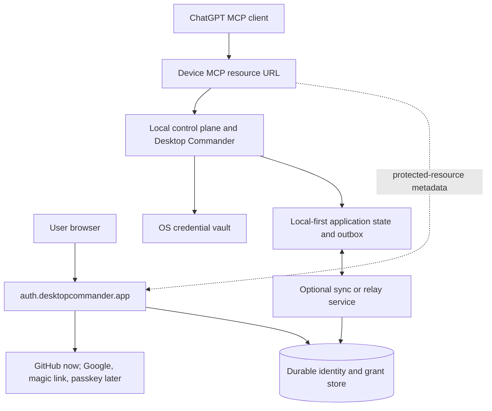

# One-click registration and local-first/serverless architecture research

Status: historical onboarding research; identity-provider recommendation superseded by the passkey-only plan — 2026-09-06

Scope: Desktop Commander Remote user registration, device pairing, and future control-plane architecture.

## Executive decision

Implement **one-action account registration**, not invisible device authorization.

Recommended product flow:

```text
desktop-commander remote connect
        |
        v
Browser opens the exact pending device request
        |
        v
[Continue with GitHub]
        |
        | creates the account automatically when needed
        | and returns to the pending request
        v
[Approve this Mac]
        |
        v
[Connect ChatGPT]
```

For the current developer-oriented audience, make **Continue with GitHub** the primary registration and sign-in action. Use **email magic link** as the recovery/fallback path. Do not require a separate sign-up mode, name field, or product-specific password. Add passkeys later for returning-user authentication, after authentication moves to one stable account domain.

This gives a literal single product action to start and complete account registration when the browser already has a GitHub session and no additional provider interaction is required. No implementation can guarantee exactly one physical click: GitHub may require account selection, MFA, or first-use consent.

Do **not** collapse the following security decisions into registration:

1. **Approve this computer** — authorizes a device to act for the account.
2. **Authorize ChatGPT** — authorizes an MCP client to invoke tools.

Those are distinct trust boundaries and should remain explicit.

## Findings from the supplied analysis

The supplied analysis is directionally correct and is supported by the current code.

### Confirmed

- The current account page has separate sign-in/sign-up modes and calls `authClient.signUp.email({ name, email, password })` or `authClient.signIn.email({ email, password })` in the separate control-plane checkout at `apps/control-plane/app/sign-in/page.tsx`.
- Better Auth enables email/password, automatic sign-in after registration, and a 12-character minimum in `apps/control-plane/lib/auth.ts`.
- No Better Auth UI or server implementation exists in this `DesktopCommanderMCP` checkout. Registration changes must also be made in the separate control-plane repository.
- `src/remote-device/device-oauth.ts` already opens `verification_uri_complete` when available.
- The current `/device` page still validates the prefilled code only after a user clicks **Continue**, then routes to `/device/approve`. That click is redundant when the request came from `verification_uri_complete`.
- `src/npm-scripts/remote.ts` explicitly separates tunnel preparation from control-plane startup. `remote tunnel prepare` prints `APP_ORIGIN`, `REMOTE_MCP_RESOURCE`, and `MCP_SERVER_URL`, then tells the operator to restart the control plane.
- The remote device stores only non-secret `stableId` continuity in `~/.desktop-commander-device/device.json`; OAuth session secrets use `NativeCredentialStore` and the OS credential vault.
- `DeviceOAuthSession` stores tokens, expiry, client ID, and scope, but not the issuer/resource identity that makes those credentials valid.
- `DeviceTokenManager` re-pairs for errors matching `invalid_grant`, `invalid_token`, or `revoked`, but does not explicitly classify issuer/resource mismatch.
- Current OAuth issuer and MCP resource identity are coupled to the same public application origin.

### Important nuance

The fastest account registration and the fastest complete onboarding are related but separate problems.

Replacing the password form removes account friction, but the largest operational delay remains:

```text
prepare stable tunnel
        -> configure/restart separate control plane
        -> start device
        -> pair
```

A social-login button alone does not produce a one-command product experience. Both tracks must be implemented:

- **identity UX:** account creation without a sign-up form;
- **runtime orchestration:** tunnel, control plane, device, and browser as one idempotent operation.

## Current architecture traced with CodeGraph

### Device-side flow in this repository

1. `runRemote()` in `src/npm-scripts/remote.ts` parses the command.
2. If a tunnel is selected, `createTunnelProvider()` starts Tailscale Funnel or zrok through `TunnelSupervisor`.
3. The command requires the public transport and OAuth metadata to be healthy before starting the device.
4. `MCPDevice.start()` in `src/remote-device/device.ts` loads the stable local ID, starts the local stdio MCP child, and initializes device OAuth.
5. `DeviceTokenManager.initialize()` loads an OS-vault session or calls `pairDevice()`.
6. `pairDevice()` dynamically registers a public OAuth client, starts RFC 8628 device authorization, opens the complete verification URL, and polls for tokens.
7. The device registers with the control plane and obtains Jazz access.
8. Later starts reuse the refresh credential and stable device ID.

### Control-plane flow in the separate checkout

1. `apps/control-plane/lib/auth.ts` constructs Better Auth against SQLite.
2. `apps/control-plane/lib/auth-plugins.ts` enables MCP OAuth, dynamic client registration, device authorization, JWTs, and device polling.
3. `apps/control-plane/app/sign-in/page.tsx` implements the email/password sign-in and create-account modes.
4. `apps/control-plane/app/device/page.tsx` accepts or validates the user code and requires **Continue**.
5. `/device/approve` performs the device authorization decision.
6. `/consent` performs MCP-client authorization for ChatGPT or another MCP client.

### Architectural coupling that blocks the future target

The current client assumes:

```text
public MCP origin == Better Auth origin == OAuth issuer origin
```

Examples:

- `authIssuer()` in `src/remote-device/device-oauth.ts` is always `${publicOrigin()}/api/auth`.
- OAuth metadata endpoints are rejected unless they use the same public origin, then rewritten to the local `MCP_SERVER_URL`.
- `checkProtectedResourceMetadata()` in `src/remote-device/tunnel/tunnel-health.ts` expects the authorization server at the tunnel origin.
- The control-plane `env.authIssuer` is derived from `APP_ORIGIN`.

This is workable for the local-hosted MVP, but it is the wrong long-term boundary for one global account across many computers and a serverless account service.

## Registration option analysis

| Option | First registration friction | Recovery | Local-first fit | Serverless fit | Recommendation |
| --- | --- | --- | --- | --- | --- |
| Email + password | Name, email, password, password policy | Requires reset-email implementation | Can run fully local | Works with a shared durable DB | Remove as primary flow |
| Email magic link | Enter email, switch to mail, click link | Strong email ownership path | Requires an email delivery service | Good if verification tokens are in durable atomic storage | Keep as fallback |
| GitHub social sign-in | One primary product click; provider may add chooser/MFA/consent | Recover through GitHub | Requires network only for account authentication | Good; callback and secret belong on a stable server | Recommended primary for MVP audience |
| Google social sign-in | Similar to GitHub and more consumer-friendly | Recover through Google | Requires network only for account authentication | Good; callback and secret belong on a stable server | Add when audience broadens |
| Passkey-first | One button plus biometric/PIN ceremony; no password | Must provide synced passkey or recovery method | Cryptographically strong, but RP ID is origin-bound | Good on a stable account domain | Add after central auth origin exists |
| Automatic anonymous/provisional account | Zero registration form | Poor until linked; easy to strand ownership | Excellent for purely local use | Account merge/linking becomes complex | Use only as an internal local profile, not the durable cloud account |

### Why GitHub first

- It removes the sign-up/sign-in distinction: the same action signs in an existing user or creates the application account after a successful provider callback.
- It avoids password storage, password reset, and another credential for the user to remember.
- It fits the present technical audience.
- Better Auth directly supports `socialProviders.github` and `authClient.signIn.social({ provider: "github" })`.

GitHub is not a universal identity provider. The production design must keep provider identity separate from the internal account ID so Google, email, or passkeys can be linked later.

### Why magic link is fallback, not primary

Better Auth magic link can automatically create a user when sign-up is enabled, but it requires an email round trip. It is passwordless, not one-click. It also introduces email deliverability, expiration, replay, and support concerns.

For a serverless deployment, magic-link verification state must use shared durable storage with atomic consume semantics. It must never depend on process memory.

### Why passkey-first should wait

Better Auth supports pre-auth passkey registration and session creation. Passkeys are strong and fast, but WebAuthn credentials are bound to an RP ID. Registering passkeys independently on per-device Funnel origins would fragment identity and create migration problems.

Passkeys should be introduced only after a stable account origin such as `https://auth.desktopcommander.app` exists. They can then become the fastest returning-user method, with GitHub or verified email retained for recovery.

## Recommended target architecture

Separate the stable **account authorization server** from each machine's stable **MCP resource server**.



### Responsibility split

#### Local machine owns

- Desktop Commander tool execution;
- local user data and application state;
- stable device ID;
- OS-vault device credential;
- durable local outbox/inbox for interrupted work;
- tunnel process and stable resource URL;
- fail-closed authorization enforcement before local side effects.

#### Serverless account service owns

- provider callbacks and account linking;
- stable internal user identity;
- OAuth authorization-server metadata and JWKS;
- device pairing attempts and grants;
- ChatGPT client grants and revocation;
- account/device directory metadata required across machines;
- audit records that must survive function restarts.

#### Relay/sync service owns

- online delivery between ChatGPT-facing requests and local devices;
- reconnect and replay-safe delivery;
- no authoritative local filesystem/process state.

Do not force a WebSocket/Jazz relay into short-lived request functions if the target serverless platform does not support durable connections. Use a managed realtime service, durable actor, queue, or separate long-lived relay. Serverless HTTP endpoints can remain stateless while durable coordination state lives in a shared store.

### Identity model

Keep these identifiers distinct:

```text
accountId       stable internal user identity
providerSubject GitHub/Google/passkey/email identity linked to accountId
deviceStableId  locally generated installation identity
deviceId        server-side registration identity
resource        canonical public MCP URL for one resource server
issuer          stable account authorization-server identity
clientId        OAuth client identity
```

Persist device credentials with a binding fingerprint:

```ts
type DeviceOAuthSession = {
  issuer: string;
  resource: string;
  clientId: string;
  accessToken: string;
  refreshToken: string;
  expiresAt: number;
  scope: string;
};
```

If `issuer` or `resource` differs from current configuration, clear only the incompatible credential and immediately start a fresh authorization flow with an actionable message.

## Fastest safe user journey

### First computer

```text
1. User runs `desktop-commander remote connect` or clicks Connect.
2. The orchestrator discovers/reuses tunnel identity, starts the local control plane,
   validates public metadata, and starts the device.
3. The browser opens the complete pending authorization request.
4. User clicks Continue with GitHub.
5. After provider success, the browser returns directly to Approve this Mac.
6. User approves the device.
7. The product shows one stable MCP URL and a Connect ChatGPT handoff.
8. ChatGPT performs its own OAuth consent.
```

### Subsequent starts

```text
start Desktop Commander
        -> restore stable tunnel
        -> restore issuer/resource-bound vault credential
        -> refresh token
        -> device online
```

Expected browser interactions: **zero**.

### Returning signed-in user pairing another machine

The complete verification URL should resolve the code automatically and display the device approval page. Expected product clicks: **Approve this Mac** only.

## Concrete implementation plan

## Phase 1 — one-action account registration

Repository: separate control-plane checkout.

1. Add GitHub provider configuration to `apps/control-plane/lib/auth.ts` or a dedicated auth-provider module.
2. Add `GITHUB_CLIENT_ID` and `GITHUB_CLIENT_SECRET` to validated server environment configuration.
3. Replace the mode-switching primary form in `apps/control-plane/app/sign-in/page.tsx` with:

   ```text
   Continue with GitHub
   Continue with email
   ```

4. Call `authClient.signIn.social({ provider: "github", callbackURL })` and preserve the pending relative callback URL.
5. Implement magic-link email delivery as fallback, including generic responses that do not reveal whether an account exists.
6. Retain email/password only behind a temporary migration path if existing local accounts need it.
7. Add account-linking and collision tests before enabling multiple providers.

Acceptance:

- A new user with an active GitHub browser session starts registration with one product click.
- No name/password form or sign-up-mode toggle appears in the primary path.
- Existing and new users return to the same pending device request.
- Provider cancellation returns a useful retry screen without losing the device code.

## Phase 2 — remove the redundant device-code step

Repository: separate control-plane checkout.

1. In `apps/control-plane/app/device/page.tsx`, detect a prefilled `user_code` from `verification_uri_complete`.
2. Validate it automatically once, then route to `/device/approve`.
3. Keep manual code entry only when no code is supplied.
4. Show device name, platform, and requested capability on the approval page.
5. Put raw OAuth client/scope/resource fields under **Advanced details**.
6. Continue displaying the user code or device identity strongly enough to preserve RFC 8628 remote-phishing defenses.

Acceptance:

- Opening `verification_uri_complete` never requires a **Continue** click.
- An invalid/expired code fails clearly and does not loop.
- Device approval remains explicit and auditable.

## Phase 3 — one-command orchestration

Repository: this checkout plus product packaging/control-plane startup code.

1. Add an idempotent command such as `desktop-commander remote connect`.
2. Introduce a startup orchestrator above `runRemote()` rather than adding more environment mutation inside `MCPDevice`.
3. Resolve or restore stable tunnel identity first.
4. Generate an immutable runtime configuration object containing local origin, public resource, and authorization-server issuer.
5. Start or supervise the packaged local control plane with that configuration.
6. Wait for local health, then tunnel transport, protected-resource metadata, and authorization-server metadata.
7. Start `MCPDevice` only after configuration is consistent.
8. Open the browser only if no compatible OS-vault session is available.

The current comment in `src/npm-scripts/remote.ts` is correct: changing the CLI process environment cannot reconfigure a separate already-running server. The product must own/supervise that process or communicate configuration through an explicit startup/configuration API. Do not hide the problem with more shell exports.

Acceptance:

- No user copies `APP_ORIGIN`, `REMOTE_MCP_RESOURCE`, or `MCP_SERVER_URL`.
- Re-running the command is safe and preserves tunnel/resource identity.
- Partial startup failure rolls back only transient changes, not stable identities.
- Normal restart does not open a browser.

## Phase 4 — bind credentials to issuer and resource

Repository: this checkout.

Likely files:

- `src/remote-device/device-oauth.ts`
- `src/remote-device/token-manager.ts`
- `src/remote-device/credential-store.ts`
- `src/remote-device/native-credential-store.ts`
- `src/remote-device/tunnel/tunnel-health.ts`
- `test/test-remote-tunnels.js` and new focused token/config tests

Tasks:

1. Add `issuer` and `resource` to `DeviceOAuthSession`.
2. Compare stored binding with current runtime configuration before refresh.
3. Classify resource/issuer mismatch as reauthorization-required.
4. Preserve the existing immediate same-startup re-pair behavior.
5. Version the OS-vault payload and migrate old sessions conservatively.
6. Inject endpoints/configuration instead of repeatedly reading mutable process environment.
7. Ensure logs identify the mismatch without printing tokens.

Acceptance:

- Changing the resource produces one understandable reauthorization flow, not a fatal startup.
- A token is never sent to a different issuer or resource.
- Refresh-token rotation remains atomic in the credential vault.

## Phase 5 — establish the serverless/local-first boundary

Repositories: control plane, this device checkout, and deployment configuration.

1. Deploy a stable account origin, for example `auth.desktopcommander.app`.
2. Move Better Auth from per-machine SQLite to a serverless-compatible durable database adapter.
3. Store rate limits, device pairing attempts, magic-link tokens, OAuth clients, grants, and revocations in shared durable storage; never process memory.
4. Change protected-resource metadata at each device URL to advertise the central authorization server.
5. Change device OAuth and health validation so issuer and resource may have different origins.
6. Fetch central OAuth endpoints directly over HTTPS; do not rewrite them to localhost.
7. Keep local data and execution local; sync only account/directory/coordination records needed for remote operation.
8. Define offline behavior explicitly: local Desktop Commander continues locally, while ChatGPT remote access reports the device offline and resumes from durable coordination state.

Acceptance:

- One account can own multiple device resources.
- A serverless function cold start loses no pending pairing/grant/revocation state.
- Local tool execution never depends on cloud availability.
- Remote calls fail closed when identity/relay services are unavailable.

## Phase 6 — evaluate native Authorization Code + PKCE

The current device pairing uses RFC 8628. Keep it while the web flow is being simplified because it already works and supports headless/SSH installations.

For the normal desktop path, evaluate Authorization Code + PKCE with an external browser and ephemeral loopback redirect:

```text
http://127.0.0.1:<random-port>/oauth/callback
```

RFC 8252 recommends this pattern for browser-capable native desktop applications; RFC 8628 is primarily for devices that lack a browser or are input constrained.

Use a dual-mode policy:

- **desktop default:** Authorization Code + PKCE with loopback callback;
- **headless/SSH fallback:** RFC 8628 with `verification_uri_complete` and polling.

Do not implement this phase until the Better Auth/OAuth provider stack is verified to support exact loopback redirect validation and PKCE for public native clients. The optimized RFC 8628 flow is sufficient for the first release.

## Suggested code structure

Avoid distributing environment reads and onboarding decisions across providers.

```ts
type RemoteRuntimeConfig = {
  localControlPlaneOrigin: string;
  publicMcpResource: string;
  authorizationServerIssuer: string;
  tunnelProvider: "tailscale" | "zrok";
};

interface RemoteStartupStage {
  inspect(): Promise<"ready" | "needs-action" | "failed">;
  ensureReady(): Promise<void>;
}
```

Suggested stages:

```text
LocalControlPlaneStage
TunnelIdentityStage
PublicTransportStage
OAuthMetadataStage
DeviceCredentialStage
DeviceRuntimeStage
ChatGptHandoffStage
```

Each stage should be idempotent, observable, and forbidden from replacing stable identity during automatic recovery.

## Local-first requirements

“Local-first” should be an architectural invariant, not a synonym for “runs on localhost.”

1. **Local authority for local effects:** filesystem/process side effects are executed only by the local device after an authenticated, durable claim.
2. **Offline local usability:** loss of account, relay, or tunnel services does not break direct local Desktop Commander use.
3. **Durable local state:** work state and unsent coordination events survive restarts.
4. **Explicit sync:** cloud/serverless stores only the minimum records needed for identity, grants, routing, and optional synchronization.
5. **Conflict/replay safety:** every remote command has a stable ID; execution is claimed before side effects and never blindly replayed after ambiguous completion.
6. **Exportability:** account and device metadata can be exported or rebuilt without recovering secrets from plaintext files.
7. **Provider independence:** GitHub authenticates a person but is not the application's primary key or authorization model.

## Security constraints

- Never call account registration itself “device approval.” Authentication proves account control; it does not prove possession or intent for a device.
- Keep ChatGPT OAuth consent separate from device approval.
- Use external browsers, never embedded credential-collecting webviews.
- Use PKCE and state for native authorization-code flows.
- Treat desktop/CLI OAuth clients as public clients; do not ship a shared client secret.
- Bind every access token to the canonical MCP `resource` audience and validate it at the resource server.
- Rate-limit dynamic client registration, user-code validation, token polling, and login attempts using shared storage.
- Store refresh credentials only in the OS vault; keep access tokens short-lived and rotate refresh tokens.
- Do not expose GitHub provider access tokens to the device or ChatGPT-facing MCP server.
- Preserve explicit revocation for devices and ChatGPT grants.
- A social-auth callback requires a stable registered domain. Do not register arbitrary per-device Funnel URLs as provider callbacks.

## Migration strategy

1. Add social identity alongside existing email/password accounts.
2. Require verified linking while signed in before merging identities with the same email; never merge solely because two providers report the same unverified address.
3. Keep existing account IDs and device ownership stable.
4. Offer current password users a one-time **Link GitHub** or **Add passkey** action.
5. Only remove password sign-in after recovery and provider-link adoption are measured.
6. Introduce the separate central issuer behind a migration flag.
7. Reauthorize device and ChatGPT credentials when issuer/resource binding changes; do not attempt to silently reinterpret old tokens.
8. Preserve stable Funnel URLs through the migration.

## Measurement and acceptance targets

Track these from command start to usable device:

| Metric | Target |
| --- | --- |
| Product actions to create account | 1 primary action, excluding provider-mandated UI |
| Product actions to pair an already signed-in user | 1 explicit device approval |
| Browser actions on normal restart | 0 |
| Manual environment variables or copied URLs before startup | 0 |
| Successful return to pending pairing after auth | >= 99% |
| Median logged-in pairing time after browser opens | <= 15 seconds |
| Median fresh social registration plus pairing | <= 60 seconds, excluding provider MFA |
| Credential/resource mismatch outcome | automatic safe reauthorization, never fatal dead-end |
| Stable MCP URL across reboot/network changes | 100% under supported tunnel conditions |

Instrument state transitions, not secrets:

```text
connect_started
tunnel_ready
control_plane_ready
browser_opened
auth_provider_started
auth_completed
device_approved
device_registered
chatgpt_handoff_shown
```

## Open decisions

1. Is the initial audience sufficiently GitHub-centric, or should Google be primary at launch?
2. What stable production domain will own Better Auth callbacks, cookies, passkeys, and JWKS?
3. Which durable database and atomic secondary store are supported by the chosen serverless runtime?
4. Is Jazz retained as the relay/sync service, hosted separately from request functions, or replaced by a queue/durable-actor design?
5. Must first-run registration work without Tailscale, with remote access enabled later?
6. What is the account-recovery policy when GitHub is unavailable or the user loses the provider account?
7. Which existing email/password accounts require migration rather than reset?
8. Does the current Better Auth OAuth provider support public native Authorization Code + PKCE with arbitrary loopback ports, or should RFC 8628 remain the permanent device flow?

## Recommended first implementation slice

Do these together as the smallest user-visible improvement:

1. Add **Continue with GitHub** and automatic account creation in the control plane.
2. Preserve the pending device callback through provider authentication.
3. Automatically process prefilled `user_code` and remove the redundant **Continue** click.
4. Keep **Approve this Mac** explicit and make it human-readable.
5. Add issuer/resource binding to device credentials in this repository.

Then implement one-command orchestration. Do not begin with passkeys or a serverless database migration; those are valuable, but they do not remove today's tunnel/control-plane startup bottleneck.

## Sources

### Current code and project documents

- `src/npm-scripts/remote.ts`
- `src/remote-device/device.ts`
- `src/remote-device/device-oauth.ts`
- `src/remote-device/token-manager.ts`
- `src/remote-device/control-plane-client.ts`
- `src/remote-device/tunnel/tunnel-health.ts`
- `docs/TAILSCALE-FUNNEL-REMOTE-MCP-PLAN.md`
- `docs/MACBOOK-MANUAL-MVP-RUNBOOK.md`
- Separate control plane: `apps/control-plane/lib/auth.ts`
- Separate control plane: `apps/control-plane/lib/auth-plugins.ts`
- Separate control plane: `apps/control-plane/lib/env.ts`
- Separate control plane: `apps/control-plane/app/sign-in/page.tsx`
- Separate control plane: `apps/control-plane/app/device/page.tsx`

### External references

- Better Auth GitHub provider: https://www.better-auth.com/docs/authentication/github
- Better Auth magic link plugin: https://www.better-auth.com/docs/plugins/magic-link
- Better Auth passkey plugin: https://www.better-auth.com/docs/plugins/passkey
- OAuth 2.0 Device Authorization Grant, RFC 8628: https://datatracker.ietf.org/doc/html/rfc8628
- OAuth 2.0 for Native Apps, RFC 8252: https://datatracker.ietf.org/doc/html/rfc8252
- MCP authorization specification: https://modelcontextprotocol.io/specification/2025-06-18/basic/authorization
