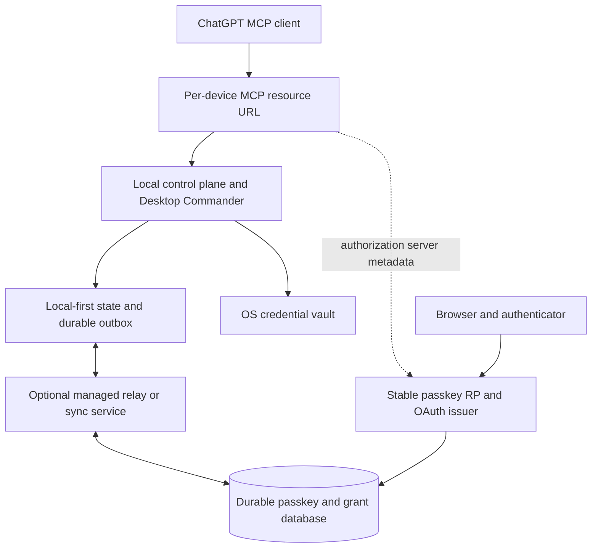

# Passkey-only registration research and implementation plan

Status: architecture narrative; canonical execution DAG/tasks are in `docs/PASSKEY-ONLY-REGISTRATION-TASK-INDEX.md`; second-pass findings/remediation are in `docs/PASSKEY-ONLY-REGISTRATION-TASK-PACK-REVIEW.md` — remediated 2026-09-07

Scope: one-action passkey registration, passkey authentication, device pairing, local-first behavior, and future serverless deployment.

This document supersedes the identity-provider recommendation in `docs/ONE-CLICK-REGISTRATION-LOCAL-FIRST-RESEARCH.md`. The code audit and onboarding findings in that document remain useful, but the target authentication system defined here uses:

- no GitHub authentication;
- no Google or other social authentication;
- no email magic links;
- no end-user passwords;
- passkeys as the only normal account credential.

## Executive decision

Implement **passkey-first, username-less registration** on a stable Desktop Commander authentication domain.

The first-time account experience should be:

```text
Create your Desktop Commander account

[Create account with a passkey]

Use Face ID, Touch ID, Windows Hello,
your device PIN, phone, or security key.
```

The user performs one Desktop Commander product action, followed by the browser/operating-system WebAuthn ceremony. The account is created and signed in only after successful passkey verification.

A browser cannot silently create a passkey. WebAuthn requires user consent and normally an operating-system authorization gesture. Therefore the honest target is:

```text
one product click + one platform passkey ceremony
```

Do not describe it as zero-interaction registration.

The full first-device flow remains:

```text
desktop-commander remote connect
        |
        v
browser opens the pending device request
        |
        v
Create account with a passkey
        |
        v
OS passkey ceremony
        |
        v
Approve this Mac
        |
        v
Connect ChatGPT and authorize
```

Device approval and ChatGPT consent remain explicit because they authorize different security boundaries. Passkey registration authenticates the account holder; it must not silently authorize a computer or an MCP client.

## Primary architectural conclusion

Production passkeys must be registered on one stable relying-party domain, for example:

```text
auth.desktopcommander.app
```

They must **not** be registered on per-device origins such as:

```text
tests-macbook-air.tail70b8a.ts.net
another-device.tail70b8a.ts.net
```

A WebAuthn credential is scoped to its RP ID. A passkey registered for one Tailscale device hostname cannot normally authenticate at an unrelated device hostname or at a later central authentication service.

WebAuthn Level 3 related-origin support does not solve this architecture:

- browser support is not universal;
- the relying party must publish an explicit origin list;
- clients may limit the number of distinct registrable origin labels;
- a dynamic and potentially large set of customer Tailscale domains is not an appropriate passkey origin set.

Therefore passkeys make separation of these identities mandatory:

```text
stable account origin and OAuth issuer
                    !=
per-device public MCP resource origin
```

The MCP resource can remain local-first and exposed through a device-specific stable tunnel. Its protected-resource metadata should advertise the central authorization server.

## Research basis

### Better Auth passkey capabilities

The current Better Auth passkey plugin supports:

- a server `passkey()` plugin backed by SimpleWebAuthn;
- a client `passkeyClient()` plugin;
- passkey-first registration with `registration.requireSession: false`;
- an opaque registration `context` passed to `resolveUser`;
- session creation after successful registration with `createSession: true`;
- creating/loading the final user after verification through registration hooks;
- username-less passkey sign-in;
- conditional UI through `signIn.passkey({ autoFill: true })`;
- multiple passkeys per user;
- passkey listing, naming, and deletion;
- storage of credential ID, public key, counter, device type, backup state, transports, creation time, and AAGUID.

The passkey plugin requires an additional database table and migration.

### WebAuthn requirements that affect this design

- WebAuthn is available only in secure contexts, except the development allowance for `http://localhost`.
- Credentials are bound to an RP ID and expected origin.
- Passkey registration is a user-consent ceremony; the authenticator must require user presence and can require user verification.
- Discoverable credentials permit authentication without asking for a username first.
- The WebAuthn user handle must be opaque, non-empty, no more than 64 bytes, and must not contain personally identifying information.
- Challenges must be random, short-lived, verified exactly, and protected from replay.
- The relying party must validate the ceremony type, challenge, origin, RP ID hash, user presence, user verification when required, credential uniqueness, and signature.
- Private keys remain inside the authenticator. The server stores only public credential material and metadata.
- Losing the only passkey can permanently lock out the account. The WebAuthn recommendation is to support multiple credentials or a recovery process.
- Signature-counter regression is a risk signal, not definitive proof of cloning; synchronized passkeys and concurrent requests require careful handling.

## Current-system audit

### Control-plane authentication audit

The separate control-plane checkout currently has no passkey flow in the indexed source.

Current state:

| Area | Current implementation | Passkey gap |
| --- | --- | --- |
| Server auth | `betterAuth()` in `apps/control-plane/lib/auth.ts` | Passkey server plugin is not configured |
| Account credential | `emailAndPassword.enabled: true` | Must be disabled for the passkey-only target |
| Registration | `authClient.signUp.email(...)` | Must become pre-auth passkey registration |
| Sign-in | `authClient.signIn.email(...)` | Must become username-less passkey authentication |
| Auth client | Shared `authClient` imported by UI | Must register `passkeyClient()` |
| Database | Better Auth persistence uses local SQLite | Needs passkey schema now and shared durable adapter for serverless deployment |
| OAuth issuer | Derived from `APP_ORIGIN` | Must move to the stable account origin |
| MCP audience | `REMOTE_MCP_RESOURCE` | Must remain the per-resource canonical URL |
| Device verification | Prefilled code still requires **Continue** | Should auto-validate and preserve explicit approval |
| Account recovery | No reset/recovery flow | Requires a passkey-only recovery policy |
| Credential management | No passkey management UI | Must support adding, naming, and deleting passkeys safely |

Relevant control-plane files identified by CodeGraph:

- `apps/control-plane/lib/auth.ts`
- `apps/control-plane/lib/auth-migration-config.ts`
- `apps/control-plane/lib/auth-plugins.ts`
- `apps/control-plane/lib/auth-client.ts`
- `apps/control-plane/lib/auth-db.ts`
- `apps/control-plane/lib/env.ts`
- `apps/control-plane/app/sign-in/page.tsx`
- `apps/control-plane/app/device/page.tsx`
- `apps/control-plane/app/device/approve/page.tsx`
- `apps/control-plane/app/consent/page.tsx`
- `apps/control-plane/lib/device-request-auth.ts`

The pinned package version and exact passkey plugin API must be verified in the control-plane package before implementation. Generated `.next` output must not be used as source of truth.

### Device-client audit

The Desktop Commander device client is authentication-method agnostic after the browser session produces OAuth authorization. That is good: passkey support belongs mainly in the authorization server and browser UI.

However, the current client assumes the authorization server is colocated with the device's MCP origin:

- `authIssuer()` in `src/remote-device/device-oauth.ts` always derives `${publicOrigin()}/api/auth`.
- `internalizeOAuthEndpoint()` rejects metadata endpoints on another origin.
- OAuth endpoints are rewritten from the public origin to the local control plane.
- `checkProtectedResourceMetadata()` expects the authorization server on the public tunnel origin.
- `checkAuthorizationServerMetadata()` builds the metadata URL from the public tunnel origin.
- `DeviceOAuthSession` does not persist `issuer` or `resource`.
- `DeviceTokenManager` does not compare stored credential binding to current runtime identity before refresh.

These assumptions block a stable central passkey RP and must change before production passkeys are issued.

Relevant files:

- `src/remote-device/device-oauth.ts`
- `src/remote-device/token-manager.ts`
- `src/remote-device/credential-store.ts`
- `src/remote-device/native-credential-store.ts`
- `src/remote-device/tunnel/tunnel-health.ts`
- `src/npm-scripts/remote.ts`
- `src/remote-device/device.ts`

### What can remain unchanged

- RFC 8628 device authorization can remain for the first passkey release.
- `verification_uri_complete` is already preferred by the device client.
- Device OAuth refresh credentials should remain in the OS credential vault.
- The local `stableId` should remain non-secret continuity data.
- Device approval and ChatGPT consent should remain distinct.
- Local Desktop Commander tool execution should remain on the controlled machine.
- The durable claim-before-side-effect rule should remain unchanged.

## Passkey-only product model

### Account identity

A passkey-only account does not require an email address, legal name, or provider profile.

Use an internal identity such as:

```ts
type PasskeyAccount = {
  id: string;
  webauthnUserHandle: string;
  displayLabel: string;
  createdAt: string;
};
```

Requirements:

- `id` is the application's stable account primary key.
- `webauthnUserHandle` is random, opaque, non-PII, and at most 64 bytes before encoding.
- The authorization subject is the stable account ID, not a credential ID.
- Multiple passkeys map to the same account and user handle.
- `displayLabel` is pseudonymous by default, for example `Desktop Commander account 7K4P`.
- An optional friendly account name can be collected after registration; it must not block onboarding.
- Never use a fabricated deliverable email address to satisfy a database schema.

A mandatory implementation spike must verify whether the installed Better Auth version supports a user record without email in passkey-first registration. If the core user schema requires email, choose one of these approaches in order:

1. configure a supported optional-email schema;
2. use an application-owned passkey account table integrated through supported hooks;
3. upgrade Better Auth to a version with supported passkey-first anonymous account records.

Do not store fake `@example.com` addresses in production and do not patch generated Better Auth code.

### Credential policy

Recommended production WebAuthn policy:

| Setting | Decision | Reason |
| --- | --- | --- |
| RP ID | Exact stable account host, e.g. `auth.desktopcommander.app` | Smallest origin scope and simplest validation |
| Origin | Exact HTTPS account origin | Prevent credential use from unexpected subdomains |
| `residentKey` | `required` | Enables username-less discoverable authentication |
| `userVerification` | `required` | Remote command authorization deserves verified user presence |
| `authenticatorAttachment` | Unset | Permit platform, roaming security-key, and hybrid/phone flows |
| Attestation | `none` | Avoid unnecessary device identification and trust-store complexity |
| Extensions | `credProps` initially | Confirm discoverability where available |
| Authentication allow-list | Empty for username-less entry | Authenticator returns user handle/credential identity |
| Registration timeout | Browser-appropriate, around five minutes | Accessibility and cross-device flow support |
| Authentication timeout | Browser-appropriate | Do not create rapid retry loops |

Do not set `userVerification: "discouraged"` merely to reduce friction. Face ID, Touch ID, Windows Hello, device PIN, and security-key PIN are the intended authentication factor.

### Registration model

The account must not become durable until the WebAuthn registration response has been verified.

Conceptual flow:

```text
1. Browser receives a short-lived signed registration intent.
2. User clicks Create account with a passkey.
3. Server generates a WebAuthn challenge and opaque pending account identity.
4. Browser invokes the authenticator.
5. User completes the platform ceremony.
6. Server verifies challenge, origin, RP ID, UV/UP, credential uniqueness, and signature.
7. Server atomically creates the account, passkey record, and authenticated session.
8. Browser consumes the registration intent and returns to the pending device approval.
```

The registration intent should include or reference:

```ts
type PasskeyRegistrationIntent = {
  jti: string;
  expiresAt: number;
  returnPath: string;
  deviceAuthorizationId?: string;
};
```

Security properties:

- one-time use;
- short expiry;
- signed or stored server-side;
- bound to the WebAuthn challenge/ceremony;
- relative allow-listed return path only;
- no OAuth tokens or secrets in the browser URL;
- no user record created after cancellation or failed verification.

### Sign-in model

Use discoverable credentials and username-less authentication.

The sign-in page should:

1. check `PublicKeyCredential` support;
2. start Better Auth conditional passkey UI when supported;
3. expose a visible **Sign in with a passkey** fallback button;
4. preserve the validated relative callback path;
5. render actionable handling for cancellation, timeout, no eligible credential, and unsupported browser/platform.

Do not automatically convert a failed sign-in ceremony into registration. WebAuthn intentionally makes “no credential” and “user cancelled” difficult to distinguish. Automatic fallback could create duplicate accounts after a cancellation.

The safe combined page is:

```text
Welcome to Desktop Commander

[Sign in with a passkey]

New here?
[Create account with a passkey]
```

A new user still performs one product click to register. A returning user can use conditional UI or one sign-in click.

### Device authorization model

Passkey authentication and device approval are separate.

After successful registration/sign-in:

```text
Approve this computer?

Tests-MacBook-Air
macOS

This computer will be able to receive Desktop Commander
requests authorized through your account.

[Cancel] [Approve this Mac]
```

For `verification_uri_complete`:

- validate the supplied user code automatically;
- do not require **Continue**;
- show the code or equivalent device context on approval for phishing resistance;
- keep manual code entry only when the URL contains no code;
- preserve the exact pairing context across passkey registration/sign-in.

## Passkey-only recovery policy

Recovery is the hardest part of a passkey-only system and must be decided before removing passwords.

### Required policy for the first release

1. Support synchronized multi-device passkeys when the authenticator provides them.
2. Allow users to add multiple passkeys to one account.
3. Encourage a second passkey after first-device onboarding.
4. Clearly show whether a credential is reported as backup eligible/backed up when that information is available.
5. Prevent deletion of the final passkey while the account owns active devices or grants.
6. Require a fresh passkey assertion before adding or deleting another passkey.
7. Provide no support-agent bypass based on a claimed email/name because the system intentionally has no verified email identity.

### Lost-all-passkeys behavior

If every passkey is lost and no synchronized or secondary passkey is available, the default behavior is:

```text
account access is unrecoverable
```

The user can create a new account and locally re-pair devices. Local Desktop Commander data remains local and must not be deleted merely because cloud account access is lost.

This consequence must be stated during onboarding and in account settings.

### Optional future local-device-assisted recovery

A local-first product can evaluate recovery through an already authorized physical device:

```text
enrolled local device credential
        +
local OS user-presence confirmation
        -> short-lived one-use passkey registration ticket
        -> register replacement passkey at the stable RP
```

This is not part of the initial implementation. A stolen or compromised authorized computer could otherwise become an account-takeover mechanism. It requires a separate threat model, revocation checks, recent device health, local user verification, audit notification, and a recovery delay or confirmation policy.

Do not implement device-assisted recovery as an undocumented shortcut.

## Local-first and serverless target architecture



### Stable account service owns

- passkey registration and authentication ceremonies;
- account, credential public key, counters, backup flags, and credential metadata;
- authenticated browser sessions;
- OAuth authorization-server metadata and JWKS;
- device authorization attempts and grants;
- ChatGPT OAuth grants and revocation;
- passkey-management authorization and audit records.

### Local machine owns

- Desktop Commander execution;
- local application data;
- stable device identity;
- OS-vault device OAuth credential;
- tunnel identity and per-device MCP URL;
- command claim and replay protection;
- offline local behavior.

### Serverless persistence rules

A serverless passkey service must not depend on process memory.

Persist durably:

- accounts and WebAuthn user handles;
- passkey credential records and public keys;
- signature counters and backup state;
- sessions;
- one-time registration intents;
- challenges if the selected Better Auth flow does not protect them entirely in signed cookies;
- OAuth clients, grants, refresh-token state, and revocation;
- rate-limit state where security depends on shared enforcement.

Operational requirements:

- all function instances use the same Better Auth secret and WebAuthn configuration;
- migrations run exactly once through deployment tooling, not on every cold start;
- credential creation and account creation are atomic;
- registration intents and challenges are single-use;
- concurrent assertion counter updates are handled transactionally;
- exact expected origin and RP ID are environment invariants;
- no edge region can accept a stale revoked credential because of uncontrolled cache propagation;
- logs never include challenges, session cookies, OAuth tokens, or full credential identifiers.

A local SQLite file is suitable for development but not for horizontally scaled serverless authentication unless the chosen platform provides compatible durable SQLite semantics. Select a supported shared SQL adapter and test transactions, uniqueness, and concurrent counter updates.

## Detailed implementation plan

## Task P0 — freeze the passkey-only product contract

Owner: product, security, and architecture.

### P0.1 Define “one-click” precisely

- Product click: **Create account with a passkey**.
- Platform interaction: biometric, PIN, phone confirmation, or security-key gesture.
- Device approval: separate explicit action.
- ChatGPT authorization: separate explicit action.
- Normal restart: zero browser interaction.

### P0.2 Choose the production RP

- Reserve the stable authentication hostname.
- Select exact `rpID` and `origin` values.
- Confirm the hostname will not change after launch.
- Confirm no untrusted content can execute on the RP origin or allowed subdomains.
- Document development RP behavior for `localhost`.

### P0.3 Decide account-loss behavior

- Confirm that no email/social/password recovery exists.
- Require users to add a second or synchronized passkey.
- Decide whether the product blocks deleting the final credential.
- Decide whether device-assisted recovery is permanently excluded or deferred.
- Write user-facing lockout language before implementation.

### P0.4 Define supported platforms

- Minimum supported Safari/macOS versions.
- Minimum Chromium/Edge versions.
- Windows Hello behavior.
- Linux browser plus phone/security-key behavior.
- Cross-device hybrid transport requirements.
- Unsupported-browser behavior.

Exit criteria:

- RP hostname, origin, credential policy, recovery policy, and browser matrix are approved.

## Task P1 — verify Better Auth passkey-first compatibility

Owner: control-plane repository.

### P1.1 Verify pinned dependencies

- Inspect the exact installed Better Auth version.
- Verify compatible `@better-auth/passkey` and SimpleWebAuthn versions.
- Confirm `registration.requireSession: false` behavior.
- Confirm `resolveUser`, `registration.afterVerification`, `context`, and `createSession` APIs against the pinned version.
- Confirm plugin ordering with MCP OAuth, device authorization, JWT, bearer, CIMD, and `nextCookies()`.

### P1.2 Prove account creation without email

Build a minimal test that proves:

- an opaque user ID can be created;
- email is not required;
- no fake email is persisted;
- the user record is created only after successful verification;
- the resulting session works with dashboard and OAuth consent code.

If unsupported, stop and select a supported schema or version before building UI.

### P1.3 Prove OAuth compatibility

- Register through passkey-first flow.
- Return to the pending RFC 8628 device request.
- Approve the device.
- Confirm OAuth subject maps to the passkey account ID.
- Confirm ChatGPT consent uses the same account session.

Exit criteria:

- A small automated spike proves passkey-only account creation and both OAuth authorization paths.

## Task P2 — add passkey dependency, schema, and configuration

Owner: control-plane repository.

Likely files:

- `apps/control-plane/package.json`
- lockfile
- `apps/control-plane/lib/auth.ts`
- `apps/control-plane/lib/auth-migration-config.ts`
- `apps/control-plane/lib/auth-plugins.ts`
- `apps/control-plane/lib/auth-client.ts`
- `apps/control-plane/lib/env.ts`
- Better Auth migration files/scripts

### P2.1 Add dependencies

- Add the compatible `@better-auth/passkey` package.
- Keep Better Auth package versions aligned.
- Record any SimpleWebAuthn transitive-version constraint.
- Avoid duplicate incompatible WebAuthn libraries.

### P2.2 Configure the server plugin

Configure passkey behavior conceptually as:

```ts
passkey({
  rpID: env.passkeyRpId,
  rpName: "Desktop Commander",
  origin: env.passkeyOrigin,
  authenticatorSelection: {
    residentKey: "required",
    userVerification: "required",
  },
  registration: {
    requireSession: false,
    resolveUser,
    extensions: { credProps: true },
  },
})
```

The exact code must follow the API verified in P1.

### P2.3 Configure the client plugin

- Add `passkeyClient()` to `authClient`.
- Keep browser-only APIs out of server-rendered modules.
- Add typed error normalization for WebAuthn cancellation and unsupported-platform errors.

### P2.4 Migrate the database

- Generate and review the passkey table migration.
- Verify unique credential-ID enforcement.
- Verify user foreign-key behavior.
- Verify counter, transports, AAGUID, device type, and backup-state storage.
- Test migration on a copy of the development database.
- Do not edit generated migration state manually without a documented reason.

### P2.5 Disable password registration

- Set `emailAndPassword.enabled` to `false` in runtime and migration configuration after migration handling is decided.
- Remove password endpoints from the visible product flow.
- Confirm no API route still permits new password account creation.
- Do not claim passkey-only while hidden password registration remains publicly callable.

Exit criteria:

- Server and client plugins compile, schema is migrated, and password registration is unavailable.

## Task P3 — implement secure passkey-first account creation

Owner: control-plane repository.

Likely files:

- new `apps/control-plane/lib/passkey-registration-intent.ts`
- new or replaced registration UI under `apps/control-plane/app/sign-in/`
- `apps/control-plane/lib/auth.ts`
- callback validation helper and tests

### P3.1 Create registration intents

- Generate cryptographically random intent IDs.
- Expire intents quickly.
- Bind each intent to an allow-listed relative return path.
- Bind the intent to a pending device authorization when applicable.
- Consume the intent atomically after successful registration.
- Reject replay, mutation, expiry, and cross-origin return targets.

### P3.2 Create opaque account identity

- Generate the stable account ID and WebAuthn user handle server-side.
- Keep the user handle non-PII and at most 64 bytes.
- Generate a pseudonymous display label.
- Do not persist the final account before verified passkey creation unless the Better Auth transaction model strictly requires a bounded pending record.
- Garbage-collect expired pending records.

### P3.3 Execute registration

- Call `authClient.passkey.addPasskey()` with the validated intent context.
- Request session creation on success.
- Require discoverable credentials and user verification.
- Verify the passkey result server-side through Better Auth/SimpleWebAuthn.
- Atomically associate the credential with the new account.
- Redirect only after session confirmation.

### P3.4 Handle failures

Provide distinct user guidance for:

- browser lacks WebAuthn;
- no compatible authenticator;
- user cancels;
- timeout;
- RP/origin misconfiguration;
- duplicate credential;
- expired registration intent;
- network failure after local ceremony;
- server verification failure.

Do not expose low-level credential IDs or stack traces.

Exit criteria:

- One product click opens the passkey ceremony and successful verification creates exactly one signed-in account.

## Task P4 — implement passkey-only sign-in

Owner: control-plane repository.

Likely files:

- `apps/control-plane/app/sign-in/page.tsx`
- `apps/control-plane/lib/auth-client.ts`
- new passkey UI/error helpers

### P4.1 Replace the current form

Remove:

- name input;
- email input;
- password input;
- sign-in/sign-up mode toggle;
- **Need an account?** password path;
- Better Auth/Jazz implementation terminology.

Add:

- **Sign in with a passkey**;
- **Create account with a passkey**;
- concise explanation of Face ID, Touch ID, Windows Hello, PIN, phone, and security-key support;
- lockout/recovery disclosure.

### P4.2 Add conditional UI

- Feature-detect conditional mediation.
- Start `signIn.passkey({ autoFill: true })` only when supported.
- Keep a visible button fallback.
- Abort stale ceremonies when navigation changes.
- Do not start multiple overlapping WebAuthn requests.

### P4.3 Preserve callback state

- Continue using a strict relative callback URL allow-list.
- Preserve the pending device or ChatGPT authorization request.
- Reject protocol-relative and absolute external redirects.
- Test callback preservation through cancellation and retry.

### P4.4 Avoid unsafe automatic registration

- Never interpret `NotAllowedError` as proof that no passkey exists.
- Never create a new account automatically after a failed sign-in.
- Keep registration as a deliberate separate action.

Exit criteria:

- The page contains no email, social, or password authentication and supports username-less passkey sign-in.

## Task P5 — integrate passkeys with device approval

Owner: control-plane repository.

### P5.1 Auto-process complete verification URLs

- Detect prefilled `user_code`.
- Normalize and validate automatically once.
- Route authenticated users directly to approval.
- Route unauthenticated users through passkey sign-in/registration and back.
- Retain manual code entry only when no code exists.

### P5.2 Improve approval content

- Show device name and platform.
- Explain the actual capability being granted.
- Keep the code or equivalent possession confirmation visible.
- Hide raw OAuth scope/client/resource under advanced details.
- Keep explicit approve and deny actions.

### P5.3 Bind final ownership

- Ensure the passkey account ID becomes the OAuth subject.
- Ensure device registration uses that subject as owner.
- Prevent callback switching between accounts.
- Audit successful, denied, expired, and replayed attempts.

Exit criteria:

- A new passkey account returns to the exact pending device and can approve it without the redundant **Continue** click.

## Task P6 — add passkey management and lockout prevention

Owner: control-plane repository.

### P6.1 Build credential management

- List passkeys without exposing raw public keys.
- Show friendly names, creation time, last use if available, device type, transports, and backup state.
- Allow renaming.
- Allow adding a second passkey after fresh authentication.
- Allow deletion after fresh authentication.

### P6.2 Protect the final credential

- Refuse deletion of the final passkey for an active account.
- Handle concurrent deletion safely.
- Revoke sessions associated with a removed or suspicious credential where supported.
- Audit credential addition and removal.

### P6.3 Encourage resilience

- After first pairing, prompt the user to add a second passkey when the first is not reported as backed up.
- Do not block immediate device readiness unless product policy explicitly requires two credentials.
- Explain that biometric data stays with the authenticator and is not sent to Desktop Commander.

Exit criteria:

- Users can maintain multiple passkeys and cannot accidentally remove their only authentication method.

## Task P7 — separate passkey issuer from device MCP resources

Owner: this `DesktopCommanderMCP` repository and control-plane deployment.

Likely device files:

- `src/remote-device/device-oauth.ts`
- `src/remote-device/token-manager.ts`
- `src/remote-device/native-credential-store.ts`
- `src/remote-device/tunnel/tunnel-health.ts`
- `src/npm-scripts/remote.ts`

### P7.1 Introduce immutable runtime identity

```ts
type RemoteIdentityConfig = {
  localControlPlaneOrigin: string;
  publicMcpResource: string;
  authorizationServerIssuer: string;
};
```

- Construct once during startup.
- Validate HTTPS for production public endpoints.
- Stop deriving issuer from MCP resource origin.
- Inject configuration rather than reading mutable environment variables throughout the flow.

### P7.2 Change OAuth discovery

- Read authorization-server location from protected-resource metadata or explicit validated configuration.
- Permit issuer and resource to have different origins.
- Fetch central OAuth endpoints directly over HTTPS.
- Internalize endpoints only for a deliberately local authorization server mode.
- Continue validating exact issuer metadata and endpoint security.

### P7.3 Change tunnel health checks

- Pass expected issuer separately to `checkProtectedResourceMetadata()`.
- Fetch authorization-server metadata from the issuer, not the tunnel host.
- Validate the device resource URL independently.
- Report transport health and authorization health separately.

### P7.4 Bind stored device sessions

Extend the stored session:

```ts
type DeviceOAuthSession = {
  version: 2;
  issuer: string;
  resource: string;
  clientId: string;
  accessToken: string;
  refreshToken: string;
  expiresAt: number;
  scope: string;
};
```

- Compare issuer/resource before using any access or refresh token.
- Clear only incompatible credentials.
- Start reauthorization in the same startup.
- Never send a token to a different issuer or resource.
- Keep refresh secrets in the OS vault.

### P7.5 Migrate existing device credentials

- Treat version-1 sessions without issuer/resource as unbound.
- Reauthorize once rather than guessing their audience.
- Preserve `stableId` and tunnel identity.
- Emit a safe explanation without token contents.

Exit criteria:

- A central passkey issuer can authorize a per-device MCP resource without origin rewriting or credential confusion.

## Task P8 — move passkey and OAuth state to serverless-compatible storage

Owner: control-plane/deployment repository.

### P8.1 Select durable storage

Evaluate supported Better Auth adapters for:

- transactional account-plus-credential creation;
- unique credential IDs;
- atomic one-time intent/challenge consumption;
- session and refresh-token persistence;
- concurrent sign-counter updates;
- backups and migration rollback;
- regional consistency requirements.

### P8.2 Remove local-process assumptions

- No in-memory registration intent authority.
- No in-memory rate limit for security-sensitive endpoints.
- No local SQLite path as production identity authority.
- No per-instance signing secret.
- No boot-time mutation that races across function instances.

### P8.3 Separate realtime infrastructure

- Keep serverless HTTP functions stateless.
- Run Jazz/realtime delivery in a managed service or long-lived deployment if required.
- Keep local durable outbox and replay-safe command IDs.
- Do not move Desktop Commander execution into the serverless tier.

### P8.4 Validate cold starts and concurrency

- Register during concurrent cold starts.
- Attempt challenge replay in another region/instance.
- Authenticate the same synchronized passkey concurrently.
- Revoke a passkey/session and test stale-cache behavior.
- Confirm JWKS and issuer metadata remain stable.

Exit criteria:

- Function replacement, cold start, and horizontal scaling do not lose or duplicate authentication state.

## Task P9 — migration from current development accounts

Owner: control-plane repository.

### P9.1 Inventory accounts

- Separate synthetic smoke-test users from intentional operator accounts.
- Identify devices and grants owned by accounts that must be retained.
- Do not inspect or expose password credential values.

### P9.2 Choose development migration

Because most existing users are test artifacts, prefer:

- export non-secret ownership records needed for tests;
- reset the development auth database;
- create fresh passkey-only test identities;
- re-pair test devices deliberately.

### P9.3 Handle any retained real account

If a real account must retain ownership:

- provide a time-boxed authenticated migration screen;
- require the existing authenticated session or current credential once;
- register at least one passkey;
- preserve the existing user/account ID;
- independently verify passkey sign-in, then disable the account's server-side legacy-login entitlement while retaining protected password verifier material through the approved rollback/soak window;
- defer destructive password-verifier retirement to the separately approved P11 contraction after rollback/soak evidence closes;
- do not use email links or social identity as migration shortcuts.

### P9.4 Remove legacy paths

- Remove password form and reset assumptions.
- Disable password registration endpoints.
- Remove password-specific copy and tests.
- Confirm seed/smoke tooling uses virtual authenticators or dedicated passkey fixtures.

Exit criteria:

- No production account depends on email/password and retained ownership is unchanged.

## Task P10 — automated testing

Owner: both repositories.

### P10.1 Unit tests

Test:

- registration-intent signing, expiry, and one-time use;
- callback URL validation;
- opaque user-handle generation and length;
- no PII in user handles;
- RP ID and origin configuration validation;
- WebAuthn error normalization;
- issuer/resource credential comparison;
- version-1 credential migration;
- final-passkey deletion guard.

### P10.2 Control-plane integration tests

Using a WebAuthn virtual authenticator, test:

- successful passkey-first registration;
- account and credential atomicity;
- failed ceremony leaves no active orphan account;
- duplicate credential rejection;
- username-less sign-in;
- wrong challenge rejection;
- wrong origin rejection;
- wrong RP ID rejection;
- missing UP/UV rejection;
- replayed assertion rejection where applicable;
- multiple passkeys on one account;
- passkey deletion and final-passkey protection;
- synchronized-passkey counter behavior;
- callback return to device approval and ChatGPT consent.

### P10.3 Device integration tests

Test:

- protected-resource metadata advertises an external central issuer;
- metadata discovery permits distinct secure origins;
- token requests retain the canonical resource parameter;
- stored session binding matches issuer/resource;
- mismatched binding triggers same-startup reauthorization;
- no browser opens on normal restart;
- revocation fails closed.

### P10.4 End-to-end browser matrix

Run real acceptance on:

- Safari with Touch ID/iCloud Keychain;
- Chrome on macOS;
- Edge with Windows Hello;
- Chrome/Firefox on Linux using phone or security key;
- cross-device hybrid flow;
- at least one roaming hardware security key;
- browser with conditional UI unavailable;
- browser/device with WebAuthn unavailable.

### P10.5 Security tests

Test:

- registration-intent replay;
- stale challenge replay;
- CSRF and session fixation;
- open redirect attempts;
- credential ID uniqueness races;
- concurrent sign-counter updates;
- XSS/CSP controls on the passkey RP;
- clickjacking/frame restrictions;
- deleted/revoked passkey behavior;
- account enumeration resistance;
- logging redaction.

Exit criteria:

- Unit, integration, security, and manual platform matrix are green before password authentication is removed from production.

## Task P11 — rollout and observability

Owner: product, control plane, device, and operations.

### P11.1 Add privacy-safe events

Track transitions only:

```text
passkey_registration_started
passkey_registration_completed
passkey_registration_cancelled
passkey_auth_started
passkey_auth_completed
passkey_auth_cancelled
second_passkey_added
device_approval_shown
device_approved
credential_binding_mismatch
```

Do not log:

- biometric or PIN information;
- challenges;
- session cookies;
- credential public keys;
- complete credential IDs;
- OAuth access/refresh tokens.

### P11.2 Add operational alerts

Alert on:

- registration verification error spikes;
- RP ID/origin mismatch;
- database uniqueness/transaction failures;
- abnormal replay failures;
- serverless regional consistency failures;
- unexpected password endpoint use after cutover.

### P11.3 Stage rollout

1. Local virtual-authenticator tests.
2. Development stable RP.
3. Internal operator accounts.
4. Real macOS/Windows/Linux matrix.
5. New passkey-only accounts.
6. Existing-account migration if required.
7. Password endpoint removal.

Exit criteria:

- Passkey registration success and cancellation rates are understood and rollback is documented.

## Acceptance criteria

### Registration

- The product shows no email, social-provider, or password registration.
- A new user starts registration with one Desktop Commander button click.
- The operating system/browser performs the passkey ceremony.
- A verified discoverable credential creates exactly one account and one session.
- Cancellation creates no active account and loses no pending device request.
- User handle contains no PII.

### Authentication

- Returning users authenticate without entering a username.
- Conditional UI is used only when supported.
- A visible passkey button always exists as fallback.
- Wrong origin, RP ID, challenge, signature, or missing required UV fails closed.

### Device onboarding

- Prefilled device code needs no **Continue** click.
- Device approval remains explicit.
- ChatGPT consent remains explicit.
- Successful passkey authentication returns to the exact pending authorization.
- Normal device restart opens no browser.

### Recovery

- Users can register multiple passkeys.
- The final passkey cannot be deleted accidentally.
- Loss of every passkey is clearly documented as account lockout for the initial release.
- Local Desktop Commander data remains usable locally after account lockout.

### Architecture

- Passkeys use one stable RP ID.
- Per-device MCP resources can advertise the central authorization server.
- Device tokens are bound to issuer and resource.
- Serverless cold starts lose no credential, challenge, session, grant, or revocation state.
- Local tool execution remains local-first and fail-closed for remote requests.

## Success metrics

| Metric | Target |
| --- | --- |
| Product clicks to start new account registration | 1 |
| Required typed identity fields | 0 |
| Password/social/email authentication paths | 0 |
| Median successful local-platform registration ceremony | <= 20 seconds after button click |
| Return to pending device request after registration | >= 99% |
| Browser interactions on normal restart | 0 |
| Active accounts with at least two or backed-up passkeys after onboarding follow-up | >= 90% |
| Credential sent to wrong issuer/resource | 0 |
| Orphan active accounts after failed registration | 0 |
| Passkey/private-key material logged | 0 |

## Risks and mitigations

| Risk | Impact | Mitigation |
| --- | --- | --- |
| RP hostname changes | Existing passkeys stop working | Freeze stable RP before production registration |
| User loses only passkey | Permanent account lockout | Synced passkeys, second-passkey prompt, final-passkey guard |
| Browser lacks WebAuthn | User cannot create an account | Published support matrix and clear unsupported-platform screen |
| Passkey sync unavailable | New-device sign-in requires phone/security key | Support hybrid and roaming authenticators; encourage second credential |
| Fake/fabricated email added to satisfy schema | Corrupt identity model | Prove email-optional Better Auth flow before implementation |
| Failed sign-in auto-creates account | Duplicate or unintended accounts | Separate explicit create action; never infer no credential from cancellation |
| Per-device origin used as RP | Fragmented account identity | Central stable passkey origin |
| Serverless instances use different secrets/config | Ceremony and session failures | Central secret management and immutable deployment config |
| Concurrent signature counters | False clone warnings or lost updates | Transactional updates; treat regression as risk signal, not automatic proof |
| XSS on RP origin | Authentication security compromised | Strict CSP, no untrusted scripts/content, exact origin validation |
| Device-assisted recovery is abused | Account takeover | Defer until separately threat-modeled and audited |

## Explicit non-goals

- Social sign-in.
- Email magic links or OTP.
- Password registration, login, or reset.
- Silent passkey creation.
- Automatic device approval after passkey registration.
- Automatic ChatGPT consent.
- Production passkeys tied to Tailscale Funnel hostnames.
- Biometric collection or storage by Desktop Commander.
- Manual support-agent account recovery without a cryptographically authorized recovery factor.
- Moving Desktop Commander tool execution into the cloud/serverless tier.

## Recommended implementation order

Execute in this order:

1. **P0:** freeze stable RP, recovery, and support policy.
2. **P1:** prove pinned Better Auth passkey-first, email-less account, and OAuth compatibility.
3. **P2:** add plugins and schema; disable new password registration.
4. **P3/P4:** implement passkey registration and sign-in UI.
5. **P5:** integrate pending device approval and remove redundant code confirmation.
6. **P6:** add multiple-passkey management and lockout prevention.
7. **P7:** split central issuer from device MCP resource and bind device credentials.
8. **P8:** move identity/OAuth persistence to serverless-compatible durable storage.
9. **P9:** reset synthetic development users or migrate retained accounts; retain password verifier material through the approved soak window.
10. **P9A:** implement the canonical deployment-state/transition/threshold/mutation and telemetry/never-log runtime foundation.
11. **P10:** complete security/platform acceptance against the already-implemented P9A artifacts.
12. **P11:** fill release thresholds/owners and perform staged rollout/rollback.

The first coding task should be the **P1 compatibility spike**, not UI work. The largest unknown is whether the exact pinned Better Auth stack can atomically create an email-less user after a successful pre-auth passkey ceremony while preserving the pending OAuth device request. Prove that boundary before committing to schema and UI changes.

## Sources

### CodeGraph-audited source

This repository:

- `src/remote-device/device-oauth.ts`
- `src/remote-device/token-manager.ts`
- `src/remote-device/credential-store.ts`
- `src/remote-device/native-credential-store.ts`
- `src/remote-device/tunnel/tunnel-health.ts`
- `src/npm-scripts/remote.ts`
- `src/remote-device/device.ts`

Separate control-plane checkout:

- `apps/control-plane/lib/auth.ts`
- `apps/control-plane/lib/auth-migration-config.ts`
- `apps/control-plane/lib/auth-plugins.ts`
- `apps/control-plane/lib/auth-client.ts`
- `apps/control-plane/lib/auth-db.ts`
- `apps/control-plane/lib/env.ts`
- `apps/control-plane/lib/device-request-auth.ts`
- `apps/control-plane/app/sign-in/page.tsx`
- `apps/control-plane/app/device/page.tsx`
- `apps/control-plane/app/device/approve/page.tsx`
- `apps/control-plane/app/consent/page.tsx`

### External references

- Better Auth passkey plugin: https://www.better-auth.com/docs/plugins/passkey
- Web Authentication Level 3: https://www.w3.org/TR/webauthn-3/
- MDN `PublicKeyCredentialCreationOptions`: https://developer.mozilla.org/en-US/docs/Web/API/PublicKeyCredentialCreationOptions
- OAuth 2.0 Device Authorization Grant, RFC 8628: https://datatracker.ietf.org/doc/html/rfc8628
- OAuth 2.0 for Native Apps, RFC 8252: https://datatracker.ietf.org/doc/html/rfc8252
- MCP authorization specification: https://modelcontextprotocol.io/specification/2025-06-18/basic/authorization
